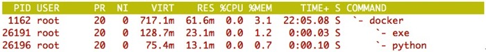
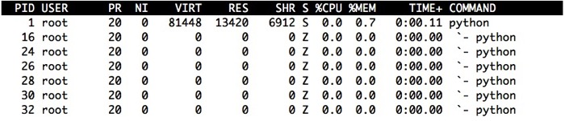
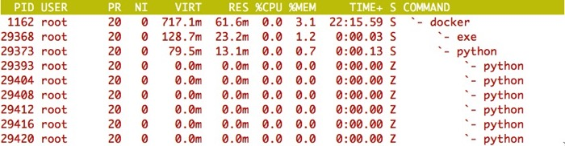
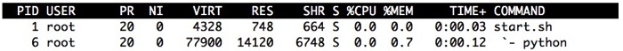

We are getting close to the end of this initial [series of posts](/posts/2015/12/running-ipython-as-docker-container/) on getting IPython to work with Docker and OpenShift. In the [last post](/posts/2015/12/unknown-user-when-running-docker/) we finally got everything working in plain Docker when a random user ID was used and consequently also under OpenShift.

Although we covered various issues and had to make changes to the existing ‘Dockerfile’ used with the ‘jupyter/notebook’ image to get it all working correctly, there was one issue that the Docker image for ‘jupyter/notebook’ had already addressed which needs a bit of explanation. This related to the existing ‘ENTRYPOINT’ statement used in the ‘Dockerfile’ for ‘jupyter/notebook’.

> 
>     ENTRYPOINT ["tini", "--"]  
>     > CMD ["jupyter", "notebook"]

Specifically, the ‘Dockerfile’ was wrapping the running of the ‘jupyter notebook’ command with the ‘tini’ command.

# Orphaned child processes

For a broader discussion on the problem that the use of ‘tini’ is trying to solve you can read the post ‘[Docker and the PID 1 zombie reaping problem](https://blog.phusion.nl/2015/01/20/docker-and-the-pid-1-zombie-reaping-problem/)’.

In short though, process ID 1, which is normally the UNIX ‘init’ process, has a special role in the operating system. That is that when the parent of a process exits prior to its child processes, and the child processes therefore become orphans, those orphaned child processes have their parent process remapped to be process ID 1. When those orphaned processes then finally exit and their exit status is available, it is the job of the process with process ID of 1, to acknowledge the exit of the child processes so that their process state can be correctly cleaned up and removed from the system kernel process table.

If this cleanup of orphaned processes does not occur, then the system kernel process table will over time fill up with entries corresponding to the orphaned processes which have exited. Any processes which persist in the system kernel process table in this way are what are called zombie processes. They will remain there so long as no process performs the equivalent of a system ‘waitpid\(\)’ call on that specific process to retrieve its exit status and so acknowledge that the process has terminated.

# Process ID 1 under Docker

Now you may be thinking, what does this have to do with Docker, after all, aren’t processes running in a Docker container just ordinary processes in the operating system, but simply walled off from the rest of the operating system.

This is true, and if you were to run a Docker container which executed a simple single process Python web server, if you look at the process tree on the Docker host using ‘top’ you will see:

Process ID ‘26196’ here actually corresponds to the process created from the command that we used as the ‘CMD’ in the ‘Dockerfile’ for the Docker image.

Our process isn’t therefore running as process ID 1, so why is the way that orphaned processes are handled even an issue?

The reason is that if we were to instead look at what processes are running inside of our container, we can only see those which are actually started within the context of the container.

Further, rather than those processes using the same process ID as they are really running as when viewed from outside of the container, the process IDs have been remapped. In particular, processes created inside of the container, when viewed from within the container, have process IDs starting at 1.

Thus the very first process created due to the execution of what is given by ‘CMD’ will be identified as having process ID 1. This process is still though the same as identified by process ID ‘26196’ when viewed from the Docker host.

More importantly, what you cannot see from with inside of the container is what was the original process with the process ID of ‘1’ outside of the container. That is, you cannot see the system wide ‘init’ process.

Logically it isn’t therefore possible to reparent an orphaned process created within the container to a process not even visible inside of the container. As such, orphaned processes are reparented to the process with process ID of ‘1’ within the container. The obligation of reaping the resulting zombie processes therefore falls to this process and not the system wide ‘init’ process.

# Testing for process reaping

In order to delve more into this issue and in particular its relevance to when running a Python web server, as a next step lets create a simple Python WSGI application which can be used to trigger orphan processes. Initially we will use the WSGI server implemented by the ‘wsgiref’ module in the Python standard library, but we can also run it up with other WSGI servers to see how they behave as well.

> 
>     from __future__ import print_function
>     
>     
>     import os
>     
>     
>     def orphan():  
>     >     print('orphan: %d' % os.getpid())  
>     >     os._exit(0)
>     
>     
>     def child():  
>     >     print('child: %d' % os.getpid())  
>     >     newpid = os.fork()  
>     >     pids = (os.getpid(), newpid)  
>     >     if newpid == 0:  
>     >         orphan()  
>     >     else:  
>     >         pids = (os.getpid(), newpid)  
>     >         print("child: %d, orphan: %d" % pids)  
>     >         os._exit(0)
>     
>     
>     def parent():  
>     >      newpid = os.fork()  
>     >      if newpid == 0:  
>     >          child()  
>     >      else:  
>     >          pids = (os.getpid(), newpid)  
>     >          print("parent: %d, child: %d" % pids)  
>     >          os.waitpid(newpid, 0)  
>     >   
>     > def application(environ, start_response):  
>     >     status = '200 OK'  
>     >     output = b'Hello World!'  
>     >     response_headers = [('Content-type', 'text/plain'),  
>     >                         ('Content-Length', str(len(output)))]
>     
>     
>         start_response(status, response_headers)
>     
>     
>         parent()
>     
>     
>         return [output]  
>     >   
>     > from wsgiref.simple_server import make_server
>     
>     
>     httpd = make_server('', 8000, application)  
>     > httpd.serve_forever()

The way the test runs is that each time a web request is received, the web application process will fork twice. The web application process itself will be made to wait on the exit of the child process it created. That child process though will not wait on the further child process it had created, thus creating an orphaned process as a result.

Building this test application into a Docker image, with no ‘ENTRYPOINT’ defined and only a ‘CMD’ which runs the Python test file application, when we hit it with half a dozen requests, what we then see from inside of the Docker container is:

For a WSGI server implemented using the ‘wsgiref’ module from the Python standard library, this indicates that no reaping of the zombie process is occurring. Specifically, you can see how our web application process running as process ID ‘1’ now has various child processes associated with it where the status of each process is ‘Z’ indicating it is a zombie process waiting to be reaped. Even if we wait some time, these zombie processes never go away.

If we look at the processes from the Docker host we see the same thing.

This therefore confirms what was described, which is that the orphaned processes will be reparented against what is process ID ‘1’ within the container, rather than what is process ID ‘1’ outside of the container.

One thing that is hopefully obvious is that a WSGI server based off the ‘wsgiref’ module sample server in the Python standard library doesn’t do the right thing, and running it as the initial process in a Docker container would not be recommended.

# Behaviour of WSGI servers

If a WSGI server based on the ‘wsgiref’ module sample server isn’t okay, what about other WSGI servers. Also, what about ASYNC web servers for Python such as Tornado.

The outcome from running the test WSGI application on the most commonly used WSGI servers, and also equivalent tests specifically for the Tornado ASYNC web server, Django and Flask builtin servers, yields the following results.

  * django \(runserver\) - **FAIL**
  * flask \(builtin\) - **FAIL**
  * gunicorn - **PASS**
  * Apache/mod\_wsgi - **PASS**
  * tornado \(async\) - **FAIL**
  * tornado \(wsgi\) - **FAIL**
  * uWSGI - **FAIL**
  * uWSGI \(master\) - **PASS**
  * waitress - **FAIL**
  * wsgiref - **FAIL**

The general result here is that any Python web server that runs as a single process would usually not do what is required of a process running as process ID ‘1’. This is because they aren’t in any way designed to manage child processes. As a result, there isn’t even the chance that they may look for exiting zombie processes and reap them.

Of note though, uWSGI when used with its default options, although it can run in a multi process configuration has a process management model with is arguably broken. The philosophy with uWSGI though is seemingly to never correct what it gets wrong, but to instead add an option which enables the correct behaviour. Thus users have to opt into the correct or better behaviour. For the case of uWSGI, the more robust process management model is only enabled by using the ‘--master’ option. If using uWSGI you should always use that option, regardless of whether you are running it in Docker or not.

Both uWSGI in master mode and mod\_wsgi, although they pass and will reap zombie processes when run as process ID ‘1’, work in a way that can be surprising.

The issue with uWSGI in master mode and mod\_wsgi, is that each only look for exiting child processes on a periodic basis. That is, they will wake up about once a second and then look for any child processes that have exited, collecting their exit status and so for zombie processes cause them to be reaped.

This means that during the one second interval, some number of zombie processes still could accumulate, the number depending on request throughput and how often a specific request does something that would trigger the creation of a zombie process. The number of zombie processes will therefore build up and then be brought back to zero each second.

Although this occurs for uWSGI in master mode and mod\_wsgi, it shouldn’t in general cause an issue as no other significant code runs in the parent or master process which is managing all the child processes. Thus the presence of the zombie process as a child for a period will not cause any confusion. Further, zombie processes should still be reaped at an adequate rate, so temporary increases shouldn’t matter.

# Problems which can arise

As to what problems can actually arise due to this issue, there are a few at least.

The first is that if the process running as process ID ‘1’ does not reap zombie processes, then they will accumulate over time. If the container is for a long running service, then eventually the available slots in the system kernel process table could be used up. If this were to occur, the system as a whole would be unable to create any new processes.

How this plays out in practice within a Docker container I am not sure. If it were the case that the upper bound of the number of such zombie processes that could be created within a Docker container were bounded by the system kernel process table size, then technically the creation of zombie processes could be used as an attack vector against the Docker host. I sort of expect therefore that Docker containers likely have some lower limit on the number of process that can be created within the container, although things get complicated if a specific user has multiple containers. Hopefully someone can clarify this specific point for me.

The second issue is that the reparenting of processes against the application process running as process ID ‘1’ could confuse any process management mechanism running within that process. This could cause issues in a couple of ways.

For example, if the application process were using the ‘wait\(\)’ system call to wait for any child process exiting, but the reported process ID wasn’t one that it was expecting and it didn’t handle that gracefully, it could cause the application process to fail in some way. Especially in the case where the ‘wait\(\)’ call indicated that an exiting zombie process had a non zero status, it may cause the application process to think its directly managed child processes were having problems and failing in some way. Alternatively, if the orphaned processes weren't themselves exiting straight away, and the now parent process operated in some way by monitoring the set of child processes it had, then this itself could be confusing the parent process.

Finally getting back to the IPython example we have been working with, it has been found that when running the ‘jupyter notebook’ application as process ID ‘1’, it fails to start up properly kernel processes for running of individual notebook instances. The logged messages in this case are:

> 
>     [I 10:19:33.566 NotebookApp] Kernel started: 1ac58cd9-c717-44ef-b0bd-80a377177918  
>     > [I 10:19:36.566 NotebookApp] KernelRestarter: restarting kernel (1/5)  
>     > [I 10:19:39.573 NotebookApp] KernelRestarter: restarting kernel (2/5)  
>     > [I 10:19:42.582 NotebookApp] KernelRestarter: restarting kernel (3/5)  
>     > [W 10:19:43.578 NotebookApp] Timeout waiting for kernel_info reply from 1ac58cd9-c717-44ef-b0bd-80a377177918  
>     > [I 10:19:45.589 NotebookApp] KernelRestarter: restarting kernel (4/5)  
>     > WARNING:root:kernel 1ac58cd9-c717-44ef-b0bd-80a377177918 restarted  
>     > [W 10:19:48.596 NotebookApp] KernelRestarter: restart failed  
>     > [W 10:19:48.597 NotebookApp] Kernel 1ac58cd9-c717-44ef-b0bd-80a377177918 died, removing from map.  
>     > ERROR:root:kernel 1ac58cd9-c717-44ef-b0bd-80a377177918 restarted failed!  
>     > [W 10:19:48.610 NotebookApp] Kernel deleted before session

I have been unable to find that anyone has been able to work out the specific cause, but I suspect it is falling foul of the second issue above. That is, the exit statuses from those orphaned processes are confusing the code managing the startup of the kernel processes, making it think the kernel processes are in fact failing, causing it to attempt to restart them repeatedly.

Whatever the specific reason, not running the ‘jupyter notebook’ as process ID ‘1’ avoids the problem, so it does at least appear to be related to the orphaned processes being reparented against the main ‘jupyter notebook’ process.

Now although for IPython it seems to relate to the second issue whereby process management mechanisms are failing, as shown above, even generic Python WSGI servers or web servers don’t necessarily do the right thing either. So even though they might not have process management issues, since they don’t perform any such management of processes for implementing a multi process configuration for the server itself, the accumulation of zombie process could still eventually cause the maximum number of allowed processes to be exceeded.

# Shell as parent process

Ultimately the solution is not to run any application process not designed to also perform reaping of child processes as process ID ‘1’ inside of the container.

There are two ways to avoid this. The first is a quick hack and one which is often seen used in Docker containers, although perhaps not intentionally. Although it avoids the zombie reaping problem, it causes its own issues.

The second way is to run as process ID ‘1’ a minimal process whose only role is to execute as a child process the real application process and then subsequently reap the zombie processes.

This minimal init process of the second approach has one other important role as well though and it is this role where the quick hack solution fails.

As to the quick or inadvertent hack that some rely on, lets look at how a ‘CMD’ in a ‘Dockerfile’ is specified.

The recommended way of using ‘CMD’ in a ‘Dockerfile’ would be to write:

> 
>     CMD [ "python", "server_wsgiref.py" ]

This is what was used above where we saw within the Docker container.

As has already been explained, this results in our application running as process ID ‘1’.

Another way of using ‘CMD’ in a ‘Dockerfile’ is to write:

> 
>     CMD python server_wsgiref.py

Our application still runs, but this isn’t doing the same thing as when we supplied a list of arguments to ‘CMD’.

The result in this case is:

With this way of specifying the ‘CMD’ our application is no longer running as process ID ‘1’. Instead process ID ‘1’ is occupied by an instance of ‘/bin/sh’.

This has occurred because supplying the plain command line to ‘CMD’ actually results in the equivalent of:

> 
>     CMD [ "sh", "-c", "python server_wsgiref.py" ]

Thus the reason for a shell process being introduced into the process hierarchy as process ID ‘1’.

With our application now no longer running as process ID ‘1’, the responsibility of reaping zombie processes falls instead to the instance of ‘/bin/sh’ running as process ID ‘1’.

As it turns out, ‘/bin/sh’ will reap any child processes associated with it, so we do not have the problem of zombie processes accumulating.

Now this isn’t the only way you might end up with an instance of ‘/bin/sh’ being process ID ‘1’.

Another common scenario where this ends up occurring is where someone using Docker uses a shell script with the ‘CMD’ statement so that they can do special setup prior to actually running their application. You thus can often find something like:

> 
>     CMD [ "/app/start.sh" ]

The contents of the ’start.sh’ script might then be:

> 
>     #!/bin/sh
>     
>     
>     python server_wsgiref.py

Using this approach, what we end up with is:

Our script is listed as process ID ‘1’, although it is in reality still an instance of ‘/bin/sh’.

The reason our application didn’t end up as process ID ‘1’ in this case is that the final line of the script simply said ‘python server\_wsgiref.py’.

Whenever using a shell script as a ‘CMD’ like this, you should always ensure that when running your actual application from the shell script, that you do so using ‘exec’. That is:

> 
>     #!/bin/sh
>     
>     
>     exec python server_wsgiref.py

By using ‘exec’ you ensure that your application process takes over and replaces the script process, thus resulting in it running as process ID ‘1’.

But wait, if having process ID ‘1’ be an instance of ‘/bin/sh’, with our application being a child process of it solves the zombie reaping problem, why not always do that then.

The reason for this is that although ‘/bin/sh’ will reap zombie processes for us, it will not propagate signals properly.

For our example, what this is means is that with ‘/bin/sh’ as process ID ‘1’, if we were using the command ‘docker stop’, the application process will not actually shutdown. Instead the default timeout for ‘docker stop’ will expire and it will then do the equivalent of ‘docker kill’ which will force kill the application and the container.

This occurs because although the instance of ‘/bin/sh’ will receive the signal to terminate the application which is sent by ‘docker stop', it ignores it and doesn’t pass it on to the actual application.

This in turn means that your application is denied the ability to be notified properly that the container is being shutdown and so ensure that it performs any required finalisation of in progress operations. For some applications, this lack of an ability to perform a clean shutdown could leave any persistent data in an inconsistent state, causing problems when the application is restarted.

It is therefore important that signals always be received by the main application process in a Docker container, but an intermediary shell process will not ensure that.

One can attempt to catch signals in the shell script and forward them on, but this does get a bit tricky as you also have to ensure that you wait for the wrapped application process to shutdown properly when it is passed a signal that would cause it to exit. As I have previously shown in an [earlier post](/posts/2015/01/using-alternative-wsgi-servers-with/) for other reasons, you might be able to use in such circumstances the shell script:

> 
>     #!/bin/sh
>     
>     
>     trap 'kill -TERM $PID' TERM INT
>     
>     
>     python server_wsgiref.py &
>     
>     
>     PID=$!  
>     > wait $PID  
>     > trap - TERM INT  
>     > wait $PID  
>     > STATUS=$?
>     
>     
>     exit $STATUS

To be frank though, rather than hoping this will work reliably, you are better off using a purpose built monitoring process for this particular task.

# Minimal init process

Coming from the Python world, one solution that Python developers like to use for managing processes is ‘supervisord’. This should work, but is a relatively heavy weight solution. At this time, ‘supervisord’ is also still only usable with Python 2. If you were wanting to run an application using Python 3, this means you wouldn’t be able to use it, unless you were okay with having to also add Python 2 to your image, resulting in a much fatter Docker image.

The folks at Phusion in that [blog post](https://blog.phusion.nl/2015/01/20/docker-and-the-pid-1-zombie-reaping-problem/) I referenced earlier do provide a minimal ‘init’ like process which is implemented as a Python script, but if not using Python at all in your image, that means pulling in Python 2 once again when you perhaps don’t want that.

Because of the overheads of bringing in additional packages where you don’t necessarily want them, my preferred solution for a minimal ‘init’ process for handling reaping of zombies and the propagation of signals to the managed process is the ‘[tini](https://github.com/krallin/tini)’ program. This is the same program that the ‘jupyter/notebook’ also makes use of and we saw mentioned in the ‘ENTRYPOINT’ statement of the ‘Dockerfile’.

> 
>     ENTRYPOINT ["tini", "--"]

All ’tini' does is spawn your application and wait for it to exit, all the while reaping zombies and performing signal forwarding. In other words, it is specifically built for this task, relieving you of worrying about whether your own application is going to do the correct thing in relation to reaping of zombie processes.

Even if you believe your application may handle this task okay, I would still recommend that a tool like ‘tini’ be used as it gives you one less thing to worry about.

If you are using a shell script with ‘CMD’ in a ‘Dockerfile’ and subsequently running your application from it, you can still do that, but remember to use ‘exec’ when running your application to ensure that signals will get to your application. Don’t use ‘exec’ and your shell script will still swallow them up.

# IPython and cloud services

We are finally done with improving on how IPython can be run with Docker so that it will work with cloud services using Docker. The main issue here we faced was the additional security restrictions that can be in place in cloud services for running Docker images in such a service.

In short, running Docker images as ‘root’ is a bad idea. Even if you are running your own Docker service it is something you should avoid if at all possible. Because of the increased risk you can understand why a hosting service is not going to allow you to do it.

With the introduction of user namespace support in Docker the restriction on what user a Docker image can run as should hopefully be able to be relaxed, but in the interim you would be wise to design Docker images so that they can run as an unprivileged user.

Now since there was actually a few things we needed to change to achieve this and a description of the changes were spread over multiple blog posts, I will summarise the changes in the next post. I will also start to outline what else I believe could be done to make the use of IPython with Docker, and especially cloud services, even better.