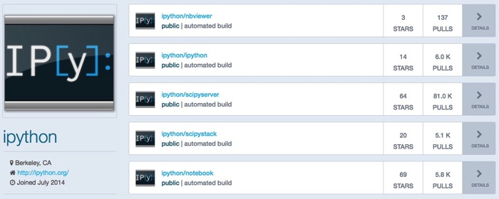

Recently I was asked to look at the problems someone was having with trying to create a Docker image for running an [IPython](http://ipython.org) notebook server on [OpenShift 3](http://www.openshift.org). Turns out there are various reasons it isn’t so straight forward. Some of the problems one encounters relate to the more strict security model that OpenShift applies to the running of Docker containers, but there are also some more general problems with making IPython run inside of Docker as well that I encountered.

Having worked through the various issues I thought it would be interesting to go through and explain them. I hope this will be useful in guiding people to build better Docker images which are more portable to different ways that Docker can be used. This is going to be much more important going forward as Docker starts to be incorporated into more high level platforms for hosting containers. Such platforms need to be more secure and robust and the short cuts people take in building Docker images can mean that although they may run in Docker on your own computer, they will not run on a hosting service which uses Docker.

# Docker images for IPython

The first place that everyone goes if they are looking for a Docker image for a specific purpose is the [Docker Hub Registry](https://hub.docker.com). If we lookup up IPython what we find is five different images being provided by the IPython project itself. Some of these are more popular that others, so what is the difference.

The first one listed is '[ipython/nbviewer](https://hub.docker.com/r/ipython/nbviewer/)’. This is described as being the 'Jupyter Notebook Viewer’, the web application behind 'The Jupyter Notebook Viewer’ hosted by Rackspace.

So this is actually the Docker image that Jupyter uses for their own [Notebook Viewer](http://nbviewer.ipython.org) service. Because this is only providing a way of viewing static HTML versions of notebooks, and not actually running IPython itself, this is not what we are after but lets see if we can still get it running on OpenShift.

# Running ipython/nbviewer

The instructions for running ‘ipython/nbviewer’ with Docker are:

> 
>     $ docker run -p 8080:8080 jupyter/nbviewer

When run it will present you with what you would see when you use the ‘[nbviewer.ipython.org](http://nbviewer.ipython.org)’ site. You can then enter in a URL, GitHub user name, GitHub repository or a Gist ID.

It will then either display the static IPython notebook or a browser which allows you to then navigate to the location of the IPython notebook and select it.

The viewer in this case is using a Tornado Web application as part of the Docker image, with it listening on port 8080 of the host that the Docker service is running on.

If we wanted to run this on OpenShift the command we would use to deploy it would be ‘oc new-app’.

> 
>     $ oc new-app ipython/nbviewer  
>     > --> Found Docker image 58551ea (40 hours old) from Docker Hub for "ipython/nbviewer"  
>     >  * An image stream will be created as "nbviewer:latest" that will track this image  
>     >  * This image will be deployed in deployment config "nbviewer"  
>     >  * Port 8080/tcp will be load balanced by service "nbviewer"  
>     > --> Creating resources with label app=nbviewer ...  
>     >  ImageStream "nbviewer" created  
>     >  DeploymentConfig "nbviewer" created  
>     >  Service "nbviewer" created  
>     > --> Success  
>     >  Run 'oc status' to view your app.

This Docker image will quite happily start up on OpenShift, but before we can actually access it, we will need to expose it.

This is necessary as by default when running a Docker image directly like this under OpenShift, it will initially only have an IP address and service name accessible within the OpenShift project it was created in. That is, it is only accessible to other applications running inside of the same OpenShift project. In order to make the web application publicly accessible, we need to perform an extra step to expose it.

The reason the extra step is required is because OpenShift can be used to run applications other than public web applications. You do not therefore want everything to be automatically made publicly accessible as that would potentially expose what could be internal back end services for your application.

The command that we need to use to actually expose the web service in this case is:

> 
>     $ oc expose service nbviewer  
>     > route "nbviewer" exposed

In exposing the web application, it will be automatically provided with a public DNS host name. To determine what the host name it was given is, you can use:

> 
>     $ oc describe route nbviewer  
>     > Name: nbviewer  
>     > Created: 10 seconds ago  
>     > Labels: app=nbviewer  
>     > Annotations: openshift.io/host.generated=true  
>     > Host: nbviewer-ipython.apps.example.com  
>     > Path: <none>  
>     > Service: nbviewer  
>     > TLS Termination: <none>  
>     > Insecure Policy: <none>

The host name it was assigned in this case was 'nbviewer-ipython.apps.example.com’. We can now visit that host name in our web browser and see the web application running.

One thing to point out is that in both the case of running it with Docker directly and under OpenShift, you are creating a single instance. If multiple users accessed it they would see the same instance. It is therefore not a complete service like with ‘nbviewer.ipython.org’, which would create a unique session for each user accessing the site.

Either way, it still isn’t allowing us to actually run IPython in our browser, so lets move to the next image we find on the Docker Hub Registry.

# Running ipython/ipython

The next image on the list of images we found for the IPython project on the Docker Hub Registry is ‘[ipython/ipython](https://hub.docker.com/r/ipython/ipython/)’

If we look very carefully at the description for this we see in the short description '**Deprecated. IPython Notebook image** ’.

So this Docker image is actually deprecated.

What is somewhat annoying is that the ‘Deprecated’ label in the short description is the only obvious indication that you shouldn’t use it. There is nothing that I can see in the full description saying not to use it, nor even a good description of how you would have used it even it hadn’t been deprecated.

This is a big problem I see with lots of Docker images on the Docker Hub Registry. That is, any documentation, if it does exist, isn’t always that useful and you need to search elsewhere for how to use the Docker image. In some cases you can’t find documentation at all and the only option is to look at the ‘Dockerfile' used to create the image, along with any associated files in any GIT repository that may be linked to in the Docker Hub Registry if it is an automated build.

Looking at the ‘Dockerfile' for this Docker image we find:

> 
>     # DEPRECATED: You probably want jupyter/notebook
>     
>     
>     FROM jupyter/notebook
>     
>     
>     MAINTAINER IPython Project <ipython-dev@scipy.org>
>     
>     
>     ONBUILD RUN echo "ipython/ipython is deprecated, use jupyter/notebook" >&2

The reason it therefore has been deprecated is because the image name changed to 'jupyter/notebook’.

Such name changes to Docker images on the Docker Hub Registry are some times needed and to ensure that existing users use of the image does still work they have at least done the right thing of creating a stand in image that is derived from the replacement image, as well as provide a warning via an ‘ONBUILD’ action if this is used as a base image, but I know I would like to see a much clearer full description on Docker Hub for that image explaining what the situation is.

Switching instead to '[jupyter/notebook](https://hub.docker.com/r/jupyter/notebook/)’ we find it described as the 'Jupyter Notebook dev image from https://github.com/jupyter/notebook'.

This looks a bit more like what we are after, with the instructions for running it with Docker being:

> 
>     docker run --rm -it -p 8888:8888 -v "$(pwd):/notebooks" jupyter/notebook

Of note with this command is that they also suggest using the ‘-v’ option to ‘docker run’.

What this option does is allow you to mount a file system volume at a particular directory inside of the running Docker container. In this case it will mount the directory where you run the container at the location ‘/notebooks’ inside of the container.

This allows you to make available within the container any data files or existing IPython notebooks without needing to build a special version of the image which embeds them. Just be careful that this is a live filesystem mount. That is, any changes made to the files in that directory within the container will be made against the original files. So if you are making heavy changes and are not sure if you will want to keep them, make sure you make a copy of the IPython notebook first and edit the copy.

Do also be aware that the ‘-v’ option here assumes that your files are on the host the Docker service is running, or that you are using Docker Toolbox, where such mounts are, through a bit of magic, allowed for anything in user home directories even though the Docker host is actually running in a VM under VirtualBox.

If your files aren’t on the Docker host or otherwise can’t be mounted, you would simply not provide the ‘-v’ option and its argument. This will leave you with an empty workspace on a directory that exists only within the running Docker container. You can still upload an IPython notebook using the web interface, but any changes to it will be lost when the container exits, unless you download the IPython notebook again to your local system after making any changes you want to keep.

That all said, when we finally run the Docker image it starts up fine and we see the familiar browser for the workspace and can create a new IPython notebook and start working.

Lets now try the 'jupyter/notebook’ image on OpenShift. This time we use the command:

> 
>     $ oc new-app jupyter/notebook  
>     > --> Found Docker image 7c8c3a2 (12 hours old) from Docker Hub for "jupyter/notebook"  
>     >  * An image stream will be created as "notebook:latest" that will track this image  
>     >  * This image will be deployed in deployment config "notebook"  
>     >  * Port 8888/tcp will be load balanced by service "notebook"  
>     > --> Creating resources with label app=notebook ...  
>     >  ImageStream "notebook" created  
>     >  DeploymentConfig "notebook" created  
>     >  Service "notebook" created  
>     > --> Success  
>     >  Run 'oc status' to view your app.

The deployment of our application gets scheduled as before, but our application never seems to start up properly, with the UI showing a warning. Using the ‘oc get pods’ command to see the state of the application we get:

> 
>     $ oc get pods  
>     > NAME READY STATUS RESTARTS AGE  
>     > notebook-1-718ce 0/1 CrashLoopBackOff 8 13m

The ‘CrashLoopBackOff’ status indicates that the application failed in some way during startup and the container was exiting immediately. If we look at the log output from the previous attempt to start the application what we find is:

> 
>     $ oc logs --previous notebook-1-718ce  
>     > /usr/local/lib/python3.4/dist-packages/IPython/paths.py:69: UserWarning: IPython parent '/' is not a writable location, using a temp directory.  
>     >  " using a temp directory.".format(parent))  
>     > Traceback (most recent call last):  
>     >   ...
>     
>     
>     File "/usr/lib/python3.4/os.py", line 237, in makedirs  
>     >  mkdir(name, mode)  
>     > PermissionError: [Errno 13] Permission denied: '/.jupyter'

The big question is why.

As a step to trying to work this out, lets run again the Docker image directly with ‘docker run’. What we will do this time though is override what command is run when the container is started. We can determine that we can do this by looking at the ‘Dockerfile’ for the ‘jupyter/notebook’ image. In it we find:

> 
>     ENTRYPOINT ["tini", "--"]  
>     > CMD ["jupyter", "notebook"]

What this means is that the actual command that will be run inside of the container is:

> 
>     tini — jupyter notebook

The second part as declared by ‘CMD’ can be easily overridden when using ‘docker run’, so lets replace the actual start up of ‘jupyter notebook’ with ‘bash’ so we can access an interactive shell.

> 
>     $ docker run --rm -it -p 8888:8888 jupyr/notebook bash  
>     > root@6b16f7389e91:/notebooks#

First up this appears to indicate that we are running as the ‘root’ user, but lets verify this and also have a look at some aspects of the environment in which the application is running.

> 
>     root@6b16f7389e91:/notebooks# whoami  
>     > root  
>     > root@6b16f7389e91:/notebooks# id  
>     > uid=0(root) gid=0(root) groups=0(root)  
>     > root@6b16f7389e91:/notebooks# pwd  
>     > /notebooks  
>     > root@6b16f7389e91:/notebooks# env | grep HOME  
>     > HOME=/root  
>     > root@6b16f7389e91:/notebooks# ls -las ~  
>     > total 40  
>     > 4 drwx------ 9 root root 4096 Dec 17 14:18 .  
>     > 4 drwxr-xr-x 53 root root 4096 Dec 18 03:25 ..  
>     > 4 -rw-r--r-- 1 root root 3106 Feb 20 2014 .bashrc  
>     > 4 drwx------ 4 root root 4096 Dec 17 14:15 .cache  
>     > 4 drwx------ 3 root root 4096 Dec 17 14:15 .config  
>     > 4 drwx------ 2 root root 4096 Dec 17 14:18 .jupyter  
>     > 4 drwxr-xr-x 3 root root 4096 Dec 17 14:15 .local  
>     > 4 drwxr-xr-x 81 root root 4096 Dec 17 14:15 .npm  
>     > 4 -rw-r--r-- 1 root root 140 Feb 20 2014 .profile  
>     > 4 drwxr-xr-x 2 root root 4096 Dec 17 14:15 tmp

How can we now run a similar check with OpenShift given that we are actually deploying somewhere to the cloud and not on our own system?

For OpenShift, it turns out you can do it using the ‘oc run’ command as:

> 
>     $ oc run notebook --image jupyter/notebook --restart Never --stdin --tty --command bash  
>     > Waiting for pod jupyter/notebook to be running, status is Pending, pod ready: false  
>     >   
>     > I have no name!@notebook:/notebooks$

Just be aware that you may not see a command prompt until after you hit enter, so if you see no output then press enter until you do.

It is now actually that prompt which is the first indication of a problem. Rather than seeing a clear indication that we are running as the ‘root’ user in the prompt itself, we get:

> 
>     I have no name!@notebook

Running the same checks again we get:

> 
>     I have no name!@notebook:/notebooks$ whoami  
>     > whoami: cannot find name for user ID 1000190000  
>     > I have no name!@notebook:/notebooks$ id  
>     > uid=1000190000 gid=0(root)  
>     > I have no name!@notebook:/notebooks$ pwd  
>     > /notebooks  
>     > I have no name!@notebook:/notebooks$ env | grep HOME  
>     > HOME=/  
>     > I have no name!@notebook:/notebooks$ ls -las  
>     > total 4  
>     > 0 drwxr-xr-x. 2 root root 6 Dec 18 03:45 .  
>     > 4 drwxr-xr-x. 22 root root 4096 Dec 18 03:45 ..

The source of our problems would therefore appear to be that we are not running as the ‘root’ user. Further, we are actually running as a user ID which has no corresponding identity within the operating system running within the container. As a consequence, there is no user name and the ‘HOME’ environment variable is also defaulting to ‘/‘.

At that point the issue then is that when ‘jupyter notebook’ is run its per user configuration settings file cannot be written to the specified home directory.

# Running as root not recommended

But why isn’t our application running as the ‘root’ user under OpenShift?

When running an application directly on your own host, running as ‘root’ is not something you would normally do unless you had a specific need to. In pursuit of best security practices it also isn’t something you should do within a Docker container either. For that reason, OpenShift enforces a default policy that nothing can be run as the ‘root’ user within a Docker container.

So although Docker may default to running as the ‘root’ user and people today view that as acceptable, expect that to increasingly be viewed as bad practice.

In other words you should start designing Docker images so that they do not have to be run as the ‘root’ user and instead can run as an unprivileged user.

There is bit more to it than just that though as things can start to get a bit more complicated when running as a user other than ‘root’. I will though follow up this post and delve into this specific issue in more detail as we continue on with exploring how to get IPython running on OpenShift.

Yes, this means another one of my long rambling series of blog posts, but hopefully you will find it interesting. :-\)

---

## Comments

### Peter Parente - December 19, 2015 at 1:18 AM

Nice post. You might want to check out the https://hub.docker.com/r/jupyter/ org on Docker Hub for more up-to-date versions of Project Jupyter images. For instance, all the images for the https://github.com/jupyter/docker-stacks project are there. Most of the ipython/\* images there are old and deprecated.

### Graham Dumpleton - December 19, 2015 at 6:55 AM

@Peter Half the post was talking about jupyter/notebook image. Part of the point of how the post flowed was to subtly highlight that people look up the obvious, that is, 'ipython' and find the older images. Yet the descriptions for the older images don't have a sufficient warning on them to say they are deprecated and point people to the replacement images. The documentation on the Docker Hub Registry should be fixed up.

