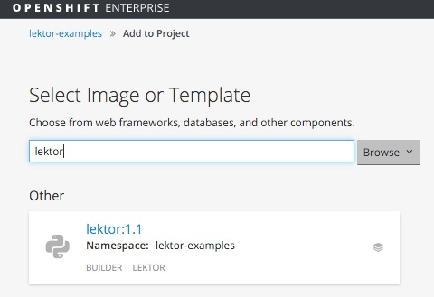
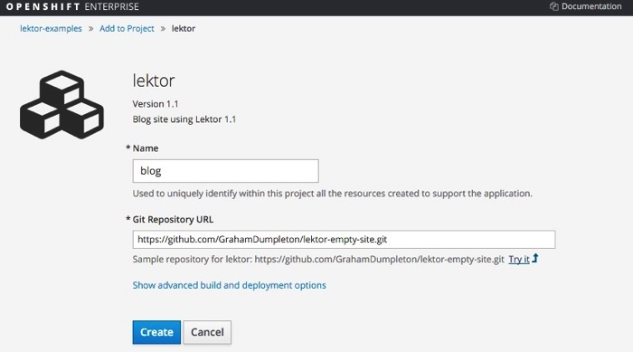
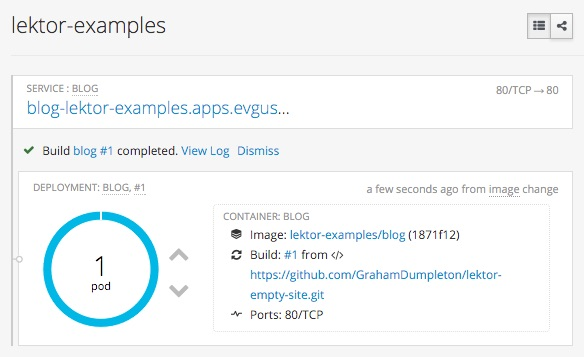
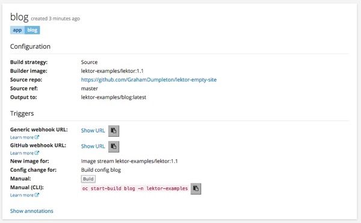

Towards the end of last year, [Armin Ronacher](http://lucumr.pocoo.org/about/) formally [announced](http://lucumr.pocoo.org/2015/12/21/introducing-lektor/) a new project of his called [Lektor](https://www.getlektor.com). Armin is one of those developers who when he creates some new piece of software, or publishes a [blog post](http://lucumr.pocoo.org), you should alway pay attention. His knowledge and attention to detail is something everyone should aspire to. So ever since he announced Lektor I have been aiming to put aside some time to have a play with it. I am hoping one day I can stop using Blogger for my own blog site and use something like Lektor instead. That isn’t to say Lektor is only for blog sites, it can be used for any sites where ultimately you could host them as a plain static web site and don’t need to run a full on dynamic web site framework.

Although Lektor itself handles well the task of generating the static content for a web site and has some support for deploying the generated files, I am not too keen on any of the deployment options currently provided. I thought therefore I would have a bit of a play with automated deployment of a Lektor blog using the Open Source [Source to Image](https://github.com/openshift/source-to-image) project for Docker and also [OpenShift](https://www.openshift.org). The goal I initially wanted to achieve was that simply by pushing completed changes to my blog site to a GitHub repository that my web site would be automatically updated. If that worked out okay, then the next step would be to work out how I could transition my existing blog posts off Blogger, including how to implement redirects if necessary so existing URLs would still work and map into any new URL naming convention for the new design.

# Creating an initial site template

Lektor more than adequately covers the creation of an initial empty site template in its [quick start guide](https://www.getlektor.com/docs/quickstart/) so I will not cover that here.

My only grumble with that process was that it doesn’t like to have the directory you want to use in existence already. If you try and use an existing directory you get an error like:

> 
>     Error: Could not create target folder: [Errno 17] File exists: ‘/Users/graham/Projects/lektor-empty-site'  
>     > Aborted!

For me this came about because I created a repository on GitHub first, made a local checkout and then tried to populate it such that everything was at the top level of the repository rather than in a sub directory. Lektor doesn’t like this. You therefore either have to create the project in a subdirectory and then move everything manually to the top level, or create the project first and then only do ‘git init’ and link it to the remote GitHub repository. If there is a way of using Lektor such that I could have populated the current directory rather than having to use a new directory, then do please let me know.

Having created the initial site template, we can then go in and make our modifications, using ‘lektor server’ on our local machine to view our updates as we make them.

# Deploying static site content

When it comes to deploying a site created using Lektor, that is where you need to move beyond the inbuilt server it provides. Because Lektor generates purely static content, you don’t need a fancy dynamic web application server and any web server capable of hosting static files will do.

There are certainly any number of hosting services still around who will host a static web site for you, or you could use S3 or GitHub pages, but I wanted something which I had a bit more control over and visibility into when there is an issue. I also don’t really want to be pushing from my local machine direct to the hosting service either. I like the idea of a workflow where things go via the Git repository where the original files for the site are located. This would allow me to coordinate with others working on a site as well, using all the same sorts of workflows one would use for normal software development, such as branching, to handle working on and finally release of the content for the site.

For hosting of minimal hand crafted static sites I have in the past used the free tiers of some of the more popular platform as a service offerings \(PaaS\), but because these services have traditionally been biased towards dynamic web applications, that meant wrapping up the static content within a custom Python web application, using something like the [WhiteNoise](https://pypi.python.org/pypi/whitenoise) WSGI middleware to handle serving the static file content.

This works, but you aren’t using a proper web server designed for static file hosting, so it isn’t the best option for a more significant site which needs to handle a lot of traffic.

What could I do then if I want to use a proper web server such as Apache and nginx?

The problem in using a traditional PaaS is that in general they do not provide either Apache or nginx as part of their standard environment and they can make it very difficult to actually install it. Alternatively, they might use Apache, but because of a fixed configuration and no ability to change it, you can’t just drop static files in and have them appear at the URL you would prefer to have them.

# Using a Docker based PaaS

Now these days, because of my work with Red Hat, I get a lot of opportunity to play with Docker and Red Hat’s newest incarnation of their PaaS offering. This is OpenShift 3 and it is a complete rewrite of the prior version of OpenShift as most would know it. In OpenShift 3 Docker is used, instead of a custom container solution, with Kubernetes handling scheduling of those containers.

Because OpenShift 3 is Docker based, this means one has much greater control over what you can deploy to a container. So where as with a traditional PaaS your options may have been limited, with OpenShift 3 and Docker, you can pretty well do what ever you want in the container and use whatever software or web server you want to use.

Given the ability to use Docker, I could therefore consider setting up a traditional Apache or nginx web server. If I were to go down that path there are even existing Docker images for both Apache and nginx on the Docker Hub registry for hosting static web sites.

The problem with using such existing Docker images though is that when using Lektor, you need to trigger a build step to generate the static files from the original source files. This requires having Lektor installed to run the build step, which also means having a working Python installation as well. These base images for Apache and nginx aren’t general purpose images though and are not going to have Python installed. As a result, the generation of the static files would need to be done using a separate system first before then somehow being combined with the base image.

The alternative is to start out with one of the web server images and create a new base image based on it which adds Python and Lektor. Conversely, you could start out with a base image for Python and then install Lektor and either Apache or nginx.

With a base image which then incorporated both the web server and Lektor, and a default ‘RUN’ action to start the web server, you could within the Lektor project for your blog site add a ‘Dockerfile’ which ran the ‘lektor build’ to generate the static content as part of the build for the Docker image.

No matter what route you take here, they all seem a bit fiddly and would still entail a fair bit of work to get some sort of automated workflow going around them.

# Builds using Source to Image

As it turns out, an OpenSource project already exists which has done a lot of the work to build that workflow. It is the project called [Source to Image](https://github.com/openshift/source-to-image) \(S2I\).

If you are familiar with the concept of build packs or cartridges as they existed for traditional PaaS offerings, think of S2I as the Docker replacement for those.

The idea behind S2I is that you have a Docker image which defines what is called a builder. This is effectively a Docker base image that combines all the common stuff that would be required for deploying software for a given problem domain, for example Python web applications, along with a special ‘assemble’ script which takes your source files and combines them with the base image to create a new Docker image to be run as the actual application.

When combining the source files with the base image, if they are actual application code files, they might be compiled into an application executable, or if using a scripting language simply copied into place to be executed by an application web server. Alternatively, the source files could be some sort of data input files that are to be used directly by an application, or after some translation process has been done. In other words, you aren’t restricted to using S2I builders just to create a new application. Instead an S2I builder could be used to combine a SaaS \(Software as a Service\) like application with the data it needs to run.

What ever the purpose of the builder and the resulting application, a further key component supplied by the S2I builder is a ‘run’ script. It is this script which is executed when the Docker image is run and which starts up the actual application.

So an S2I builder contains all the base software components that would be required for an application, plus the ‘assemble’ and ‘run’ scripts defining how the source code is combined with the builder image and then subsequently how to start the application.

What isn’t obvious is how our source files gets copied in as part of this process. This is where the ‘s2i’ program from the Source to Image package comes into play. It is this which takes the source code, injects it into our running S2I builder, triggers the ‘assemble’ script and then snapshots the container to create a new Docker image.

To make things a little clearer, lets try an example.

For this I am going to use an S2I builder which has been created for use with OpenShift for deploying Python web applications. This S2I builder can be found on the Docker Hub registry and is called ‘openshift/python-27-centos7’.

In using the ‘s2i’ program there are two ways that you can supply your source files. The first is to point at a remote Git repository hosted somewhere like GitHub. The second is to point at a local file system directory containing the source files.

In this case I am going to use the repository on GitHub located at:

  * https://github.com/GrahamDumpleton/wsgi-hello-world

The ‘s2i’ program is now run, supplying it the location of the source files, the name of the S2I builder image on the Docker Hub registry and the name to be given to the Docker image produced and which will contain our final application.

> 
>     $ s2i build https://github.com/GrahamDumpleton/wsgi-hello-world.git openshift/python-27-centos7 my-python-app  
>     > ---> Copying application source ...  
>     > ---> Installing dependencies ...  
>     > Downloading/unpacking gunicorn (from -r requirements.txt (line 1))  
>     > Installing collected packages: gunicorn  
>     > ...  
>     > Successfully installed gunicorn  
>     > Cleaning up...  
>     >   
>     > 
>     
>     
>     $ docker images  
>     > REPOSITORY TAG IMAGE ID CREATED VIRTUAL SIZE  
>     > my-python-app latest beda88ceb3ad 14 minutes ago 444.1 MB

With the build complete, we can now run our application.

> 
>     $ docker run --rm -p 8080:8080 my-python-app  
>     > ---> Serving application with gunicorn (wsgi) ...  
>     > [2016-01-17 10:49:58 +0000] [1] [INFO] Starting gunicorn 19.4.5  
>     > [2016-01-17 10:49:58 +0000] [1] [INFO] Listening at: http://0.0.0.0:8080 (1)  
>     > [2016-01-17 10:49:58 +0000] [1] [INFO] Using worker: sync  
>     > [2016-01-17 10:49:58 +0000] [30] [INFO] Booting worker with pid: 30

and access it using ‘curl’ to validate it works.

> 
>     $ curl $(docker-machine ip default):8080  
>     > Hello World!

Important here to understand is that it wasn’t necessary to define how to create the Docker image. That is, all the WSGI 'Hello World’ Git repository contained was:

> 
>     $ ls -las  
>     > total 40  
>     > 0 drwxr-xr-x    8 graham staff   272  7 Jan 19:21 .  
>     > 0 drwxr-xr-x   71 graham staff  2414 17 Jan 14:05 ..  
>     > 0 drwxr-xr-x   15 graham staff   510 17 Jan 15:18 .git  
>     > 8 -rw-r--r--    1 graham staff   702  6 Jan 17:07 .gitignore  
>     > 8 -rw-r--r--    1 graham staff  1300  6 Jan 17:07 LICENSE  
>     > 8 -rw-r--r--    1 graham staff   163  6 Jan 17:09 README.rst  
>     > 8 -rw-r--r--    1 graham staff     9  6 Jan 21:05 requirements.txt  
>     > 8 -rw-r--r—     1 graham staff   278  6 Jan 17:09 wsgi.py

There was no ‘Dockerfile’. It is the ‘s2i’ program in combination with the S2I builder image which does all this for you.

# An S2I builder for static hosting

As you can see from above, the S2I concept already solves some of our problems of how to manage the workflow for creating a Docker image which contains our web site built using Lektor.

The part of the puzzle we still need though is a Docker base image which combines both a web server and Python runtime and which we can add in the ‘assemble’ and ‘run’ scripts to create a S2I builder image.

This is where I am going to cheat a little bit.

This is because although I demonstrated an S2I builder for Python above, I actually have my own separate S2I builder for Python web applications. My own S2I builder is more flexible in its design than the OpenShift S2I builder. One of the things it supports is the use of Apache/mod\_wsgi for hosting a Python web application. To do this it is using ‘mod\_wsgi-express’.

One of features that ‘mod\_wsgi-express’ so happens to have is an easy ability to host static files using Apache in conjunction with your Python web application. It even has a mode whereby you can say that you are only hosting static files and don’t actually have a primary Python web application.

So although primarily designed for hosting Python web applications, my existing S2I builder for Python web applications provides exactly what we need in this case. That is, it combines in one base image a Python runtime, along with Apache, as well as an easy way to start Apache against static file content.

If we were running on our normal machine at this point and not using Docker, the steps required to build our static files from our Lektor project and host it using ‘mod\_wsgi-express’ would be as simple as:

> 
>     $ lektor build --output-path /tmp/data  
>     > Started build  
>     > U index.html  
>     > U about/index.html  
>     > U projects/index.html  
>     > U blog/index.html  
>     > U static/style.css  
>     > U blog/first-post/index.html  
>     > Finished build in 0.07 sec  
>     > Started prune  
>     > Finished prune in 0.00 sec  
>     >  
>     
>     
>     $ mod_wsgi-express start-server --application-type static --document-root /tmp/data  
>     > Server URL : http://localhost:8000/  
>     > Server Root : /tmp/mod_wsgi-localhost:8000:502  
>     > Server Conf : /tmp/mod_wsgi-localhost:8000:502/httpd.conf  
>     > Error Log File : /tmp/mod_wsgi-localhost:8000:502/error_log (warn)  
>     > Request Capacity : 5 (1 process * 5 threads)  
>     > Request Timeout : 60 (seconds)  
>     > Queue Backlog : 100 (connections)  
>     > Queue Timeout : 45 (seconds)  
>     > Server Capacity : 20 (event/worker), 20 (prefork)  
>     > Server Backlog : 500 (connections)  
>     > Locale Setting : en_AU.UTF-8

We could then access our web site created by Lektor at the URL ‘http://localhost:8000/'.

Even though this appears so simple, it is actually running a complete instance of Apache. It is this easy because ‘mod\_wsgi-express’ does all the hard work of automatically generating the Apache configuration files to use for this specific site based only on the command line arguments provided. The configuration files for this instance are all generated totally independent of any existing Apache configuration you may have for the main Apache instance on your machine and so will not interfere with it.

# An S2I builder for Lektor

In order to now create our S2I builder for Lektor, we are going to build on my existing S2I builder base image for Python web applications. I don’t believe I have specifically blogged about my S2I builder for Python before, although I have mentioned before some of the work I have been doing on Docker base images for Python web applications.

The existing Docker base image for Python web applications is on the Docker Hub registry as ‘grahamdumpleton/mod-wsgi-docker’. As to the S2I builder support I have been working on, this has been rolled into that same image, although if wishing to use it as an S2I builder you will need to instead use ‘grahamdumpleton/mod-wsgi-docker-s2i’. This latter image is pretty minimal and just sets the exposed ‘PORT’ and ‘USER’. 

> 
>     # grahamdumpleton/mod-wsgi-docker-s2i:python-2.7  
>     >   
>     > FROM grahamdumpleton/mod-wsgi-docker:python-2.7
>     
>     
>     USER 1001
>     
>     
>     EXPOSE 80
>     
>     
>     CMD [ "/usr/local/s2i/bin/usage" ]

For our Lektor S2I builder image, what we are now going to use is the following ‘Dockerfile’.

> 
>     # grahamdumpleton/s2i-lektor:1.1  
>     >   
>     > FROM grahamdumpleton/mod-wsgi-docker-s2i:python-2.7
>     
>     
>     RUN pip install Lektor==1.1
>     
>     
>     COPY .whiskey /app/.whiskey/

This ‘Dockerfile’ only does two additional things on top of the underlying S2I builder for Python. The first is to install Lektor and the second is to copy in some extra files into the Docker image. Those extra files are:

> 
>     .whiskey/server_args  
>     > .whiskey/action_hooks/build

What you will note is that we aren’t actually adding any ‘assemble’ or ‘run’ scripts as we have talked about. This is because these already exist in the base image and already do everything we need to prepare the image and then start up a web server for us.

Different to how the OpenShift S2I Python builder is designed, the ‘assemble’ and ‘run’ scripts here are designed with a means for application specific hooks to be supplied to perform additional steps at the time of building the image or deploying the application. This is what these two files are about that we copied into the image.

Of these, the ‘.whiskey/action\_hooks/build’ file is a shell script which is invoked by the ‘assemble’ script during the build of the Docker image. What it contains is:

> 
>     #!/usr/bin/env bash  
>     >   
>     > lektor build --output-path /data

This will be run by the ‘assemble’ script in the same directory as the source files that were copied into the image from either the local source directory or the remote Git repository.

This script therefore is what is going to trigger Lektor to generate the static files for our site. The files will be generated into the ‘/data’ directory.

The second file called ‘.whiskey/server\_args’ contains:

> 
>     --application-type static --document-root /data

With the way that the base image is setup, and ‘run’ called when the Docker image is started, it will by default automatically run up ‘mod\_wsgi-express’. It will do this with a number of default options which are required when running ‘mod\_wsgi-express’ in a Docker container, such as directing logging to the terminal so that Docker can capture it. What the ‘server\_args’ file does is allow us to supply any additional options to ‘mod\_wsgi-express’. In this case we are giving it options to specify that it is to host static files with no primary Python WSGI application being present, where the static files are located in the ‘/data’ directory.

And that is all there is to it. Because the base image is already doing lots of magic, we only had to provide the absolute minimum necessary, taking advantage of the fact that the base image is already employing all necessary best practices and smarts to make things work.

For the complete source code for this S2I builder image for Lektor you can see:

  * https://github.com/GrahamDumpleton/s2i-lektor

A Docker image corresponding to Lektor 1.1 is also already up on the Docker Hub registry as ‘grahamdumpleton/s2i-lektor:1.1’. As such, we can now run ‘s2i’ as:

> 
>     $ s2i build https://github.com/GrahamDumpleton/lektor-empty-site.git grahamdumpleton/s2i-lektor:1.1 my-lektor-site  
>     > ---> Installing application source  
>     > ---> Building application from source  
>     > -----> Running .whiskey/action_hooks/build  
>     > Started build  
>     > U index.html  
>     > U about/index.html  
>     > U projects/index.html  
>     > U blog/index.html  
>     > U static/style.css  
>     > U blog/first-post/index.html  
>     > Finished build in 0.08 sec  
>     > Started prune  
>     > Finished prune in 0.00 sec
>     
>     
>     $ docker run --rm -p 8080:80 my-lektor-site  
>     > ---> Executing the start up script  
>     > [Sun Jan 17 12:28:03.698888 2016] [mpm_event:notice] [pid 17:tid 140541365122816] AH00489: Apache/2.4.18 (Unix) mod_wsgi/4.4.21 Python/2.7.11 configured -- resuming normal operations  
>     > [Sun Jan 17 12:28:03.699328 2016] [core:notice] [pid 17:tid 140541365122816] AH00094: Command line: 'httpd (mod_wsgi-express) -f /tmp/mod_wsgi-localhost:80:1001/httpd.conf -E /dev/stderr -D MOD_WSGI_STATIC_ONLY -D MOD_WSGI_MPM_ENABLE_EVENT_MODULE -D MOD_WSGI_MPM_EXISTS_EVENT_MODULE -D MOD_WSGI_MPM_EXISTS_WORKER_MODULE -D MOD_WSGI_MPM_EXISTS_PREFORK_MODULE -D FOREGROUND'

Testing our site with ‘curl’ we get:

> 
>     $ curl $(docker-machine ip default):8080  
>     > <!doctype html>  
>     > <meta charset="utf-8">  
>     > <link rel="stylesheet" href="./static/style.css">  
>     > <title>Welcome to Empty Site! — Empty Site</title>  
>     > <body>  
>     >  <header>  
>     >  <h1>Empty Site</h1>  
>     >  <nav>  
>     >  <ul class="nav navbar-nav">  
>     >  <li class="active"><a href="./">Welcome</a></li>
>     
>     
>     <li><a href="./blog/">Blog</a></li>
>     
>     
>     <li><a href="./projects/">Projects</a></li>
>     
>     
>     <li><a href="./about/">About</a></li>
>     
>     
>     </ul>  
>     >  </nav>  
>     >  </header>  
>     >  

>     
>     
>     <h2>Welcome to Empty Site!</h2>  
>     >  
This is a basic demo website that shows how to use Lektor for a basic  
>     > website with some pages and a blog.

>     
>     
>       
>     >  
  
>     >  <footer>  
>     >  &copy; Copyright 2016 by Graham Dumpleton.  
>     >  </footer>  
>     > </body>

# Integration with OpenShift

As seen, the S2I system gives us a really easy way to produce a Docker image, not only for your own custom Python web application where you provide the source code, but also scenarios where you might be simply using existing data with an existing application. We did something like the latter with Lektor, although we actually also generated the required data to be hosted by the web server as part of the build process.

When running the ‘s2i’ program we were also able to use source files in a local directory, or from a remote Git repository. Even so, this still only gives us a Docker image and we would need to host that somewhere.

For most Docker based deployment systems, this would entail needing to push your Docker image from your own system, or a CI/CD system, to a Docker registry. The hosting service would then need to pull that image from the Docker registry in order to deploy it as a live web application.

If however using the latest OpenShift things are even simpler. This is because OpenShift integrates support for S2I.

Under OpenShift, all I need to do to deploy my Lektor based blog site is:

> 
>     $ oc new-app grahamdumpleton/s2i-lektor:1.1~https://github.com/GrahamDumpleton/lektor-empty-site.git --name blog  
>     > --> Found Docker image a95cedc (17 hours old) from Docker Hub for "grahamdumpleton/s2i-lektor:1.1"  
>     >  * An image stream will be created as "s2i-lektor:1.1" that will track this image  
>     >  * A source build using source code from https://github.com/GrahamDumpleton/lektor-empty-site.git will be created  
>     >  * The resulting image will be pushed to image stream "blog:latest"  
>     >  * Every time "s2i-lektor:1.1" changes a new build will be triggered  
>     >  * This image will be deployed in deployment config "blog"  
>     >  * Port 80/tcp will be load balanced by service "blog"  
>     > --> Creating resources with label app=blog ...  
>     >  ImageStream "s2i-lektor" created  
>     >  ImageStream "blog" created  
>     >  BuildConfig "blog" created  
>     >  DeploymentConfig "blog" created  
>     >  Service "blog" created  
>     > --> Success  
>     >  Build scheduled for "blog" - use the logs command to track its progress.  
>     >  Run 'oc status' to view your app.  
>     >   
>     > 
>     
>     
>     $ oc expose service blog  
>     > route "blog" exposed

I can then access the blog site at the host name which OpenShift has assigned it. If I have my own host name, then I just need to edit the route which was created to make the blog site public to add in my own host name instead.

In this case I needed to use the OpenShift command line tool to create my blog site, but we can also load up a definition into our OpenShift project which will allow us to build our blog site direct from the OpenShift UI.

This definition is provided as part of the ‘s2i-lektor’ project on GitHub and so to load it we just run:

> 
>     $ oc create -f https://raw.githubusercontent.com/GrahamDumpleton/s2i-lektor/master/lektor.json  
>     > imagestream "lektor" created

If we now go to the OpenShift UI for our project we have the option of adding a Lektor based site.

Clicking through on the ‘lektor:1.1’ entry we can now fill out the details for the label to be given to our site and the location of the Git repository which contains the source files.

Upon clicking on ‘Create’ it will then go off and build our Lektor site, including making it publicly accessible.

By default only a single instance of our site will be created, but if it were an extremely popular site, then to handle all the traffic we would just increase the number of pods \(instances\) running. When a web application is scaled in this way, OpenShift will automatically handle all the load balancing of traffic across the multiple instances. We do not need to worry ourselves about needing to set up any front end router or deal with registration of the back end instances with the router.

When it comes to making changes to our site and redeploying it we have a few options.

We could manually trigger a rebuild of the site through the UI or the command line after we have pushed up our changes to GitHub, or we could instead link the application in OpenShift with our GitHub repository. To do the latter we would configure a web hook into our repository on GitHub. What will happen then is that every time a change is made and pushed up to the Git repository, the application on OpenShift will be automatically rebuilt and redeployed for us.

We have now achieved the goal I was after and have a complete workflow in place. All that I would have to worry about is updating the content of the blog site and pushing up the changes to my Git repository when I am happy for them to be published.

# Trying out OpenShift yourself

Although I showed a full end to end workflow combining Docker, S2I and OpenShift, if you aren’t interested in the OpenShift part you can definitely still use S2I with a basic Docker service. You would just need to incorporate it into an existing CI/CD pipeline.

If you are interested in the new OpenShift based on Docker and Kubernetes and want to experiment with it, then you have a few options. These are:

  * [OpenShift Origin](https://www.openshift.org) \- This is the Open Source upstream project for the OpenShift products by Red Hat.
  * [AWS Test Drive](https://aws.amazon.com/testdrive/redhat/) \- This is an instance of OpenShift Enterprise which you can spin up and try on Amazon Web Services.
  * [All In One VM](https://www.openshift.org/vm/) \- This is a self contained VM which you can spin up with VirtualBox on your own machine.

If you do decide to try OpenShift and my Lektor S2I builder do let me know. I also have an S2I builder for creating IPython notebook server instances as well. The IPython S2I builder can pull your notebooks and any files it needs from a Git repository just like how the Lektor S2I builder does for a Lektor site. It is also possible with the IPython images to spin up a backend IPython cluster with as many engines as you need if wishing to play around with parallel computing with ‘ipyparallel’.

Unfortunately right now the existing [OpenShift Online](https://www.openshift.com) PaaS offering from Red Hat is still the older OpenShift version so is not based around Docker and Kubernetes. Hopefully it will not be too much longer before a version of OpenShift Online using Docker and Kubernetes is available. That should make it a lot easier to experiment with the features of the new OpenShift and how easy it can be to get a web site hosted, like by Lektor example shown here.