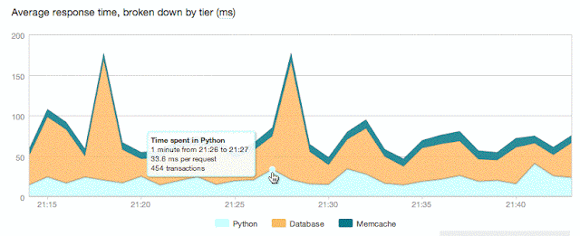
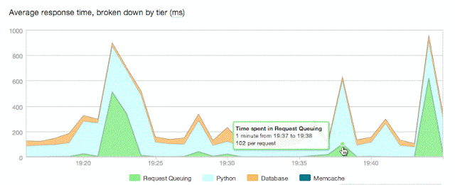

It has been a busy year for me this year with lots of work to do and numerous overseas trips and Python conferences. In the end I spent almost three months away from home. Being so busy I haven't really said anything on my blog about what I am up to at my new job at [New Relic](http://www.newrelic.com/). Well, not so new of a job now as has been almost a year since I started.  
  
This time last year I had already been looking for a new job for about 8 months with only minimal leads. I had given my prior job lots of notice that I wasn't going to renew my contract after eight and half years, although I did say that if found something sooner I would leave early. I didn't expect to actually see the full contract period out, but that is what happened. Even a few weeks out from the end of the contract at the end of November I still hadn't found anything. Out of the blue though someone recommended me to New Relic. When I started looking at what New Relic did my reaction was 'oh wow, this is so awesome'.  
  
The reason I found what New Relic was doing so exciting was that a recurring question I would get from users of mod\_wsgi was on how to configure it to work best for a specific site. Although I could wave my hands around and prognosticate about it, ultimately the answer was always 'it depends on your specific web application'. In short, I couldn't tell them because I had absolutely no insight into what their application was doing, and neither did they usually. In all probability the real problems were going to be their application, database or client side page rendering times and not how mod\_wsgi had been set up.  
  
The problem here was that people would too often assume that all their problems would be solved magically somehow by finding the fastest web server or configuration on the planet. Their weapon of choice in trying to resolve their problems was to run hello world benchmarks against different web servers and then picking which looked better based on some arbitrary requirement. Too many times I could only watch and shake my head at people because although I knew they were barking up the wrong tree, I didn't know of any good production grade tools for Python web applications I could point them at which could be used to show them where the real bottlenecks were in their stack.  
  
I had at various times tried to instrument mod\_wsgi to collect data about number of concurrent request executing and other measures as a way of trying to determine whether a specific configuration was working, but the stumbling block was always the lack of a decent infrastructure to collect and display the results of that. Just dumping out occasional statistics to the Apache error log wasn't going to fly and was only ever going to be an amateurish attempt. As a result I pulled out the instrumentation code from mod\_wsgi that I had added as didn't want such a half baked solution, especially one where people may still be dependent on me to try and interpret it.  
  
So how did I see New Relic even being able to help? Well the best way to illustrate this is to just look at some of the charts that the New Relic UI can produce from data which is generated from your application.  
  

  
This is the main overview chart in the New Relic UI and gives a good heads up break down of where time is being spent in your application. Straight away in this example we can already start to ponder why so much time is being spent doing database queries and memcache calls. Is it because of the number being made within any one request or are there network delays or performance issues with the database and memcache system.  
  
Obviously this one chart isn't going to answer those questions but that is where one can start to drill down further using the New Relic UI into the data and look at the different database queries and also at individual transaction traces for sampled slow transactions.  
  
Now you might be saying so what, Django debug toolbar can do these sorts of thing. Yes it can, but there is one important difference. That is that Django debug toolbar only looks at a single web transaction and you should only be running it in a development environment. The chart shown above represents live data streaming out your production web application. So not only can it show aggregated performance metrics over time, it is based on real requests from real customers from your production deployed web application.  
  
This specific chart, insightful as it is, leaves off one thing that got me quite excited as far as the perpetual question of how best to configure mod\_wsgi. For that lets look at another example.  
  

  
In this chart we are also displaying what is labelled as request queueing time. This isn't actually time spent in the web application itself, but is recording the time the request spent waiting to be handled by the web application.  
  
For the case of mod\_wsgi in daemon mode this would be the time between when the Apache child worker process first accepted the request and when the request was able to be proxied across to the mod\_wsgi daemon process and be handled.  
  
For a well tuned web application the request queueing time should be negligible and ideally in the order of 1ms. Obviously in this case something quite bad was going wrong to cause such spikes in queueing time.  
  
The prime candidate for what could be wrong is that the number of processes/threads which have been configured for mod\_wsgi daemon mode was inadequate for the number of concurrent requests being handled. In other words, get too many concurrent requests and you run out of processes/threads to handle them. As a result the requests start to backlog after being initially accepted by the Apache child worker processes. Eventually the daemon processes catch up and finish the requests they were handling and the queued requests get handled, but the user has had to suffer the delay in the request being handled.  
  
Now under normal circumstances for this site the number of configured processes/threads was more than adequate. As it turned out, although that is what showed as the symptom, it was exacerbated by an underlying factor. This was that due to unknown reasons at the time, resolution of host names with a DNS server was some times taking a long time. This would affect a batch of requests at one time and all would appear to hang for a period and as this happened the available processes/threads would get used up and the backlog occur.  
  
So even this one chart in the New Relic UI can say a lot already and yet it only scratches the surface as far as the full set of features available. The only problem was that they didn't support Python and it wasn't even on the radar at that time. It was partly in the hope I guess that they would support Python that I was recommended to them by one of their existing customers who used their product on other other languages.  
  
Needless to say I saw all this and thought I gotta work on this somehow. Luckily the New Relic guys could see I grokked what they were doing and by the time I did talk to them had even already worked out a rough idea in my head of how one would go about doing it for Python.  
  
Bringing all this awesomeness to the Python web community is therefore what I have been working on this year and it certainly has kept me busy. We started our public Beta in conjunction with DjangoCon back in September and I gave a [presentation](http://lanyrd.com/2011/djangocon-us/sggrt/) at DjangoCon as well talking about some of the low level techniques one has to deal with in trying to instrument and monkey patch existing code.  
  
At this point the frantic pace is starting to ease up a little so I will be starting to say more about the Python agent and New Relic here on my blog and also on the [New Relic blog site](http://blog.newrelic.com/), so keep an eye out. Even if I wasn't working there and the guy getting to implement it, I know I would still be excited about what this is going to bring to the Python web community and hopefully you will as well and at least give it a once over.  
  
A final word. Although New Relic is a paid for service with varying subscription levels, you do get a trial period where you can try it out and get access to all the features. Even at the end of that period it will revert to a free Lite subscription level which still provides you with some of the main charts, including the one shown above. So, is a great opportunity to get some instant insight into what your web application is doing at a deep level and even if you don't want to sign up for the higher subscription levels, the Lite version still may prove useful in at least giving you that higher level view of what is going on.