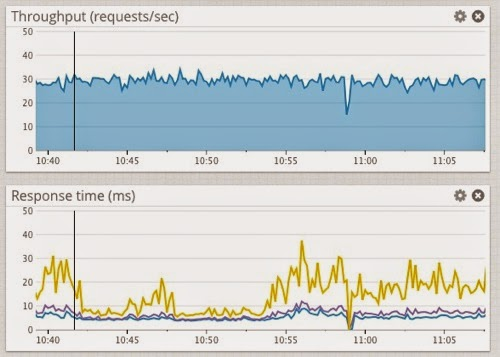
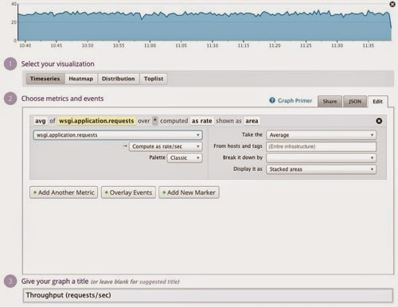
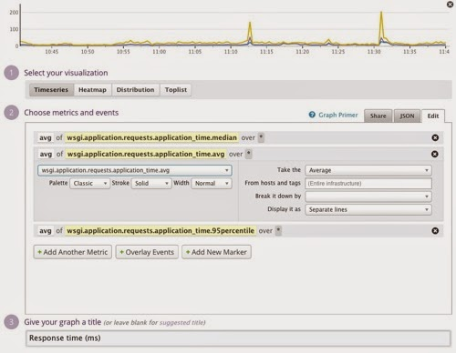
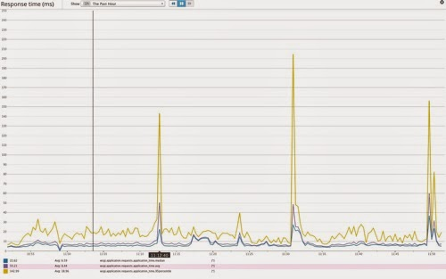
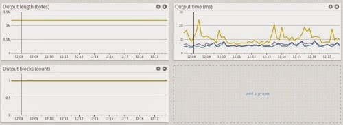

Attempting to monitor WSGI application response times and other details of a web request using 'print' statements, as described in the last few [posts](/posts/2015/05/monitoring-response-content-from-wsgi/), may be okay for when playing around in a development environment to understand how a WSGI server works, but it is totally inadequate when wanting to monitor traffic against a real web site. In a production setting, or even just a testing or QA environment, we need to get the raw information we are collecting for all the WSGI application traffic out into a separate system of some sort where it can be analysed and visualised.

A common set of Open Source tools which is often used for the collection and visualising of such time series data is [statsd](https://github.com/etsy/statsd) and [Graphite](http://graphite.readthedocs.org). In this blog post I am going to show how one can hook up the WSGI middleware that was previously constructed for monitoring WSGI application requests to a statsd instance. Being a lazy sort of person though, and wishing to avoid any pain in needing to setup statsd and Graphite myself, I am actually going to use the [Datadog](http://www.datadoghq.com) monitoring service. Datadog has a free tier which provides the main features we will need to illustrate the approach.

If you have previously used a different Python client for statsd, you will find that the Datadog API for statsd may be somewhat different to what you may be used to. So I would suggest you check out the Datadog [documentation](http://docs.datadoghq.com) for any differences. I will in some latter posts be using some features which I believe are specific to Datadog which make analysing of the metric data easier. You may therefore need to work out how to translate that into what functionality is provided by any direct statsd client you use.

# Recording the response time

Going back and adapting the original WSGI middleware for recording the response time to use the statsd interface of Datadog we end up with:

```
 from wrapt import decorator, ObjectProxy  
 from timeit import default_timer

 from datadog import statsd

 def record_request_metrics(application_time):  
     statsd.increment('wsgi.application.requests')

     statsd.timing('wsgi.application.requests.application_time',  
         1000.0 * application_time)

 class WSGIApplicationIterable5(ObjectProxy):

     def __init__(self, wrapped, start):  
         super(WSGIApplicationIterable5, self).__init__(wrapped)  
         self._self_start = start

     def close(self):  
         if hasattr(self.__wrapped__, 'close'):  
             self.__wrapped__.close()

         duration = default_timer() - self._self_start

         record_request_metrics(duration)

 @decorator  
 def timed_wsgi_application5(wrapped, instance, args, kwargs):  
     start = default_timer()

     try:  
         return WSGIApplicationIterable5(wrapped(*args, **kwargs), start)

     except:  
         duration = default_timer() - start

         record_request_metrics(duration)

         raise
```

This wrapper is recording two separate metrics.

The first is 'wsgi.application.requests' and is a counter recorded using 'statsd.increment\(\)'. It tracks the number of requests which have been made.

The second is 'wsgi.application.requests.application\_time' and is used to track how long it took for the request to be handled by the WSGI application using 'statsd.timing\(\)'. Note that statsd expects the time value in this case to be supplied as milliseconds.

Although statsd doesn't enforce any specific naming structure beyond what characters you can use in a name, the name you choose is quite important. Specifically, because all the metrics reported into statsd end up in the same metric database, you should use a naming hierarchy to clearly indicate the meaning of a metric. More descriptive names modelled as part of a naming hierarchy are better.

In this case I have used a top level name of 'wsgi' as a way of indicating that I am monitoring a WSGI server. The next level of 'application' is used to indicate that the metric is then something specific to a WSGI application, as opposed for example to something related to the WSGI server process it is running in, such as memory usage.

Finally the 'requests' level of the naming hierarchy indicates we are dealing with metrics related to web requests handled by the WSGI application. I use this same top level category for 'requests' to also act as the counter for the number of requests made. Technically I could retrieve the same value from the counters associated with the tracking of the application time, but some times it makes things clearer to break out a counter separately like this.

# Visualisation inside Datadog

Jumping into Datadog, we can now construct a visualisation from these metrics showing the throughput and response time.



For the top chart displaying the throughput I have charted the counter recorded as 'wsgi.application.requests'.



Being a counter, this can be displayed as the actual count, but instead I have chosen to display it as a rate metric showing the number of requests/sec. Doing this avoids a lot of confusion as the result will be the same no matter what time period you have selected in the UI. If you choose to display it as a count, then the number shown can vary dependent on the time period displayed due to how data buckets are merged together and values counted when displaying a larger time period.

For the bottom chart displaying the response time you can see there are actually three different lines on the chart. They correspond to the median, average and 95th percentile. That we have these sub categories available for this metric is a by product of having used 'statsd.timing\(\)' to record the metric.



We chart more than one value for the response time as relying on the average alone can be misleading. This is because the average can be skewed by very large one off response times which are outside of the normal. By also displaying the 95th percentile then one gets a better indication of what time value the majority of the web requests come in under, but with those outliers still being excluded.

When you have more than one line on the chart, you can hover over the chart and tooltip like overlays will appear explaining what the line represents. It is also possible to expand the view of the chart itself to get a better view along with a legend.



# Response content metrics

As well as the response time, we can also record metrics for the details of the response content being returned as was previously explored. Adding those in we now end up with:

```
from wrapt import decorator, ObjectProxy
from timeit import default_timer
from datadog import statsd

def record_request_metrics(application_time, output_time=None, output_blocks=None, output_length=None):
    statsd.increment('wsgi.application.requests')
    statsd.timing('wsgi.application.requests.application_time', 1000.0 * application_time)
    if output_time is not None:
        statsd.timing('wsgi.application.requests.output_time', 1000.0 * output_time)
    if output_blocks is not None:
        statsd.histogram('wsgi.application.requests.output_blocks', output_blocks)
    if output_length is not None:
        statsd.histogram('wsgi.application.requests.output_length', output_length)

class WSGIApplicationIterable5(ObjectProxy):
    def __init__(self, wrapped, start):
        super(WSGIApplicationIterable5, self).__init__(wrapped)
        self._self_start = start
        self._self_time = 0.0
        self._self_count = 0
        self._self_bytes = 0

    def __iter__(self):
        time = 0.0
        start = 0.0
        count = 0
        bytes = 0
        try:
            for data in self.__wrapped__:
                start = default_timer()
                yield data
                finish = default_timer()
                if finish > start:
                    time += (finish - start)
                start = 0.0
                count += 1
                bytes += len(data)
        finally:
            if start:
                finish = default_timer()
                if finish > start:
                    time += (finish - start)
            self._self_time = time
            self._self_count = count
            self._self_bytes = bytes

    def close(self):
        if hasattr(self.__wrapped__, 'close'):
            self.__wrapped__.close()
        duration = default_timer() - self._self_start
        record_request_metrics(duration, output_time=self._self_time,
                              output_blocks=self._self_count,
                              output_length=self._self_bytes)

@decorator
def timed_wsgi_application5(wrapped, instance, args, kwargs):
    start = default_timer()
    try:
        return WSGIApplicationIterable5(wrapped(*args, **kwargs), start)
    except:
        duration = default_timer() - start
        record_request_metrics(duration)
        raise
```

In the case of 'wsgi.application.requests.output\_time', as it is a time value we have used 'statsd.timing\(\)' once again. For the value tracking the number of bytes and number of blocks, we could have used 'statsd.gauge\(\)', but this would have just given us the average. Instead we use 'statsd.histogram\(\)', which like 'statsd.timing\(\)' provides us with the ability to display the median and 95th percentile as well as the average.



In a situation where the amount of response content generated can in practice vary between request, this may provide us additional detail about the variance in what is being generated. In this test example we were generating the same amount of data as a single block all the time, so each of these will actually end up being the same.

# Problems of aggregation

Up till now we have been focusing on specific single test examples each time and so the expected data for each web request would be similar. In practice in a complex web site you will have many different handlers for different URLs and how long each takes to complete will vary, as will the amount of data being produced.

In such a real world application, although a global summary as shown in the charts above is still useful in its own way, that all data for different handlers gets aggregated together hides the specifics of how handlers for specific URLs are performing.

Unfortunately statsd alone doesn't necessarily provide a good solution for capturing both an aggregation of response time metrics across the whole WSGI application, as well as a breakdown on a per handler basis. As I understand it, one would have to record additional metrics to the rollup metrics, with different metric names for each handler.

If using the Datadog API for statsd there is a better way of handling both rollup metrics and more specific metrics which drill down into specific handlers. I will go into this in a subsequent post, but before I get to that, in the next post I first want to look at how our current WSGI middleware could be replaced by what some WSGI servers may provide themselves to support collection of metric information.