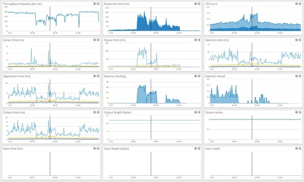
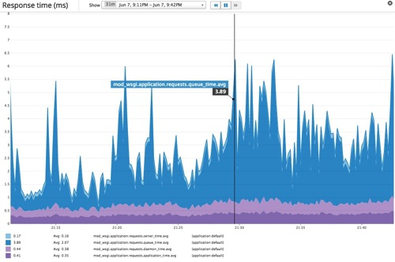
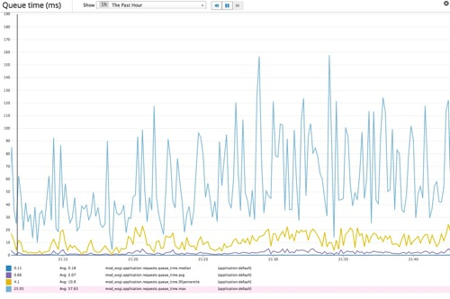

In my [last blog post](/posts/2015/05/performance-monitoring-of-real-wsgi/) I showed how a WSGI middleware could be used to monitor aspects of a web request and push metric data out to statsd for collation and eventual visualisation.


Although a WSGI middleware can be used as the basis for WSGI application monitoring, there is a risk, depending on what it is tracking, that it can introduce overheads and so impact the overall time spent in the WSGI application handling a web request. This is particularly the case if wanting to collect data about the volume of request content and response content, how reading and writing of that content may be broken up, and how much time was spent in the WSGI server performing those operations.

A better approach would be for such monitoring to be implemented down in the WSGI server itself. This is because by being implemented in the WSGI server, one can avoid the need to setup the WSGI middleware as well as the overhead of the function wrappers required by the WSGI middleware. Instead the specific code dealing with a request in the WSGI server can simply be enhanced to track information in any existing context where the information is already available.

Various monitoring capabilities have been implemented for mod\_wsgi, including at the Apache server level, worker/daemon process level and request level. Due however to there being more pushback over the initial introduction of the monitoring features in mod\_wsgi than actual interest, continued public release of the capabilities was shelved. Instead the new features were restricted to an unreleased prototype and I have been using the monitoring capabilities purely for my own interest and as a means for me to understand the behaviour of mod\_wsgi and address any issues in mod\_wsgi found.

For the purposes of the investigation I have been pursuing through these blog posts whereby I am using benchmarks to investigate how WSGI servers work, I am going to start to making use of these monitoring capabilities in this prototype to at least support this goal. Maybe the discussion will trigger a more positive response about these capabilities this time round.

Although the prototype as mentioned has capabilities for monitoring the whole of Apache, worker/daemon processes and individual requests, in this post I will only look at monitoring for individual requests. Just keep in mind however that what is described here is not available in any official release of mod\_wsgi. There is no timeline as to when or even if these capabilities will ever be made available. Even if released at some point, details may change from what is described here.

# Request event notifications

Rather than a WSGI middleware needing to be used as previously described, an alternative way that can be used to monitor web requests when done at the WSGI server level is to use event based notifications.

The idea here is that a user supplied event notification callback would be registered and it would be called at least at the end of a web request with details of the request as collected by the WSGI server. That callback function can then take the data and report it into any actual monitoring system it chooses to.

By using an event notification system in this way, the WSGI server itself doesn't need to be bound to any specific monitoring system and that detail can be left up to users themselves. If inclined, third parties could make available extensions which act as a bridge to specific monitoring systems, thereby removing the burden from the WSGI server developer and avoid any conflicts over the developers choice as to supported backends.

For what was implemented in the mod\_wsgi prototype, the per request event notification callback to print out the response time for each request would be implemented as:

```python
    def event_handler(name, **kwargs):  
    if name == 'request_finished':  
    application_time = kwargs.get('application_time')  
    print('finish %.3fms' % (1000.0 * application_time))
```

If wishing to report the metric data to statsd, one could instead use:

```python
    def event_handler(name, **kwargs):  
    if name == 'request_finished':  
    application_time = kwargs.get('application_time')  
    statsd.timing('mod_wsgi.application.requests.application_time',  
    1000.0 * application_time)
```

For the prototype implementation, the amount of time spent in the WSGI application for the web request wasn't the only information available, nor was the notification that the request is finished the only type of event.

For a specific web request, the prototype implementation could produce up to four different events. These events were:

  * **request\_started**
  * **response\_started**
  * **request\_finished**
  * **request\_exception**


# The start of request event

The start of request event was named 'request\_started'. It would be generated for each web request immediately prior to the WSGI application entry point being called. The attributes of this event were:

  * **thread\_id** \- The integer ID of the thread in the request thread pool that handled the request.
  * **request\_start** \- The time at which the request was originally accepted by the Apache web server.
  * **queue\_start** \- When the WSGI application is running in daemon mode, the time at which the Apache child worker process first attempted to proxy the request through to the daemon process.
  * **daemon\_connects** \- When the WSGI application is running in daemon mode, the number of attempts made before the connection to the daemon process was accepted.
  * **daemon\_restarts** \- When the WSGI application is running in daemon mode, the number of connection attempts to the daemon process which were rejected because the daemon process needed to first restart to reload the WSGI application.
  * **daemon\_start** \- When the WSGI application is running in daemon mode, the time at which the request was accepted by the daemon process.
  * **application\_start** \- The time at which the WSGI server regarded processing of the request by the WSGI application to have started.
  * **application\_object** \- The object corresponding to the WSGI application entry point being called.
  * **request\_environ** \- The per request WSGI 'environ' dictionary containing the details of the request.


# The start of response event

The start of response event was named 'response\_started'. It would be generated when the WSGI application had called the 'start\_response\(\)' function which was passed in to the WSGI application when called to handle the request. The attributes of this event were:

  * **response\_status** \- This is the HTTP status line containing the HTTP status code and reason.
  * **response\_headers** \- The list of HTTP response headers.
  * **exception\_info** \- Any exception details if supplied.


Due to how the WSGI specification works this event could actually be generated more than once for a request. This would be the case where a WSGI application encounters an exception between the time it calls 'start\_response\(\)' and any response content is generated. Technically the WSGI application is in this situation allowed to replace the existing response details by calling 'start\_response\(\)' a second time. This capability within the WSGI specification is rarely used by WSGI applications for frameworks.

# The end of request event

The end of request event was named 'request\_finished'. It would be generated when handling of the request had completed, whether the request was successful or an exception occurred. This would be after any 'close\(\)' method on the iterable returned by the WSGI application had been called by the WSGI server. The attributes of this event were:

  * **application\_finish** \- The time at which the WSGI server regarded processing of the request by the WSGI application to have finished.
  * **application\_time** \- How long the request took to be handled by the WSGI application, being the difference between the start and finish times.
  * **input\_reads** \- How many separate reads of request content were performed at the WSGI server level.
  * **input\_length** \- How many bytes of request content were successfully read in for the request.
  * **input\_time** \- How much time was spent in the WSGI server reading request content.
  * **output\_writes** \- How many separate writes of response content were performed at the WSGI server level.
  * **output\_length** \- How many bytes of response content were written back to the HTTP client.
  * **output\_time** \- How much time was spent in the WSGI server writing back response content.
  * **cpu\_user\_time** \- The amount of user CPU time which was consumed by the request thread in handling the request.
  * **cpu\_system\_time** \- The amount of system CPU time which was consumed by the request thread in handling the request.


# The exception raised event

The exception raised event was named 'request\_exception'. This would be generated if an exception made its way back all the way to the level of the WSGI server. That is, if it wasn't caught and handled by the WSGI application. Such an exception might be raised when the WSGI application entry point was originally called, when consuming the response content, or when the 'close\(\)' method of any iterable returned by the WSGI application was called. Due to the multiple points an exception could occur and because 'close\(\)' on the iterable is called even when an exception is raised while consuming the response content, this event could technically occur more than once per request. The attributes of this event were:

  * **exception\_info** \- The details of the exception which occurred.


# Visualisation of metrics

From these events one can use a custom adapter to extract metrics and input them into a tool such as statsd. The information available by virtue of the monitoring being embedded in the WSGI server is much more in depth that what can be achieved through the use of a WSGI middleware alone.



For example, in the case of mod\_wsgi and in particular when daemon mode is being used, it is possible to get timing values for how long the request took to progress through Apache from when it was first accepted, until the point it was handled by the WSGI application running in the daemon process.



This extra level of information is very important when it comes to being able to tune Apache and mod\_wsgi to provide the best performance as it allows one to better determine where the bottlenecks are occurring. In this particular case for example, where the server was under heavy load, although the time spent within the WSGI application was averaging less than one millisecond, the average time the request took in being proxied from the Apache child worker process to the daemon process \(the queue time\), was peaking up over four milliseconds.

Knowing that the queue time here is an issue and that averages don't always show the true picture, we can look instead at the distribution of the queue time.



This actually shows that 95% of requests were passed through with a queue time of ten milliseconds or less. In the worst case though, this was peaking up to over one hundred milliseconds.

These charts might therefore be showing the inability of the mod\_wsgi daemon processes to pick up new requests quickly enough, either through provision of inadequate capacity or other factors.

Even though we have more detailed information than might be obtainable from a WSGI middleware alone, per request monitoring still isn't enough to provide the full picture of what is going on. Per request monitoring doesn't in this case for example allow you to determine how much of the available capacity of the specific process and the server as a whole was actually being used.

To get this information it is also necessary to monitor at the process and server level across all requests. What mod\_wsgi provides in that space I will cover in a future blog post.