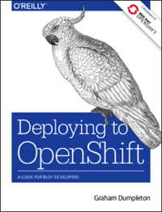

I have been more than a bit busy over the past year and this blog has become somewhat neglected. One of the reasons for being so busy was that I was working on a second book. As with the first book, which I co-authored, this book is on OpenShift. This time I am the sole author, and the book somewhat thicker, so you can imagine it has taken a fair bit of time and effort.

For those who may not know what OpenShift is, it is recognised as the go-to distribution of Kubernetes for the enterprise. Like how the Linux kernel is much more useful when it's packaged into a Linux distribution such as RHEL, Debian or Ubuntu, OpenShift takes Kubernetes and adds the extra components required to turn it into a complete container platform for running your containerised workloads.

Another way of putting it is that OpenShift is a platform to help you develop and deploy applications across a cluster of machines at scale. These can be public facing web applications, or backend applications, including micro services or databases. Applications can be implemented in any programming language you choose. The only requirement is that the application can run within a container. In terms of cloud service computing models, OpenShift implements the functionality of both a Platform as a Service \(PaaS\) and a Container as a Service \(CaaS\).

Using OpenShift as a CaaS, you can bring a pre-existing container image built to the Open Container Initiative \(OCI\) Image Specification \(image-spec\) and deploy it. The PaaS capabilities of OpenShift build on top of the ability to deploy a container image, by providing a way for you to build in OpenShift your own container image direct from your application source code and have it deployed. The application source code can consist of a Dockerfile with instructions to build a container image. Or, you can use a Source-to-Image \(S2I\) builder, which takes your application source code and converts it into a container image for you, without you needing to know how to write instructions for building a container image.

If that sounds interesting and you would like to read the book, the good news is that the book is provided free, compliments of Red Hat, where I work as a developer advocate for OpenShift.

To download the free electronic version, you can visit:

> <https://www.openshift.com/promotions/deploying-to-openshift.html>

The book aims to be a practical guide which describes in detail how OpenShift, building on Kubernetes, enables you to automate the way you create, ship, and run applications in a containerized environment, be they cloud-native applications, or more traditional stateful applications.

In the book, you will learn the following concepts:

  * Create a project and deploy pre-existing application container images
  * Build application container images from source and deploy them
  * Implement and extend application image builders
  * Use incremental and chained builds to accelerate build times
  * Automate builds by using a webhook to link OpenShift to a Git repository
  * Add configuration and secrets to the container as project resources
  * Make an application visible outside the OpenShift cluster
  * Manage persistent storage inside an OpenShift container
  * Monitor application health and manage the application lifecycle

I hope you enjoy this free book and that it will help you get up and running on OpenShift. If looking for an environment to try out OpenShift, you can sign up for the free [OpenShift Online Starter](https://www.openshift.com/get-started/) environment hosted by Red Hat.

BTW, this is the fourth book made available by Red Hat about OpenShift. I am quite proud to be able to say that every one of those books had an author from Australia. To carry through on the Australian flavour to the books, for this book the cover animal is the Australian [Sulphur-Crested Cockatoo](https://en.wikipedia.org/wiki/Sulphur-crested_cockatoo). These birds are a frequent visitor to my home. Unfortunately the picture doesn't show their true larrikin like character.