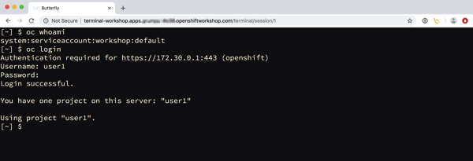
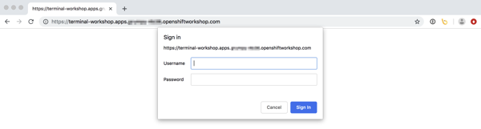
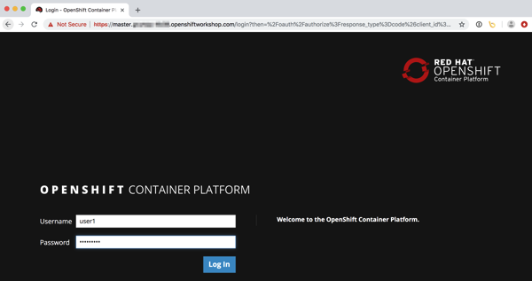
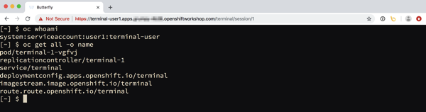

In the [last blog post](/posts/2018/12/using-jupyterhub-as-generic-application/) I explained that JupyterHub can be used to spawn instances of applications other than Jupyter notebooks. Because JupyterHub can also handle user authentication, this made it a handy way of spinning up distinct user environments when running workshops. Each attendee of the workshop would be given access to a shell environment running in a separate pod inside of Kubernetes, with access via an interactive terminal running in their web browser. This meant that they did not need to install anything on their local computer in order to complete the workshop.

For the interactive terminal, the [Butterfly](https://github.com/paradoxxxzero/butterfly) application was used. This is a backend Python application implemented using the Tornado web framework, with the in browser terminal support being based on term.js.

Butterfly being a self contained application provides an easy way of deploying an interactive terminal session to a remote system in your web browser without needing to implement a custom web application from scratch. It isn't a complete drop in solution though, the reason being that for authentication it relies on PAM. That is, it requires that it be run as the root user, and that a user and corresponding password exist in the UNIX user database.

For a container based deployment using OpenShift, because the default security model prohibits the running of containers as root, this meant that the existing container image for Butterfly isn't suitable. We also don't want Butterfly handling authentication anyway and want JupyterHub to handle it, albeit that we still need access to the Butterfly instance be authorised in some way.

The latter is necessary because although JupyterHub handles user authentication, once that is done, all subsequent web traffic for the users instance only traverses the JupyterHub configurable HTTP proxy, which doesn't authorise subsequent access to the users instance.

When deploying Jupyter notebooks behind JupyterHub, to ensure that subsequent access is correctly authorised, the Jupyter notebook instance will perform its own OAuth handshake against JupyterHub to get an access token for the user, determine who the user is, and then check whether the user should have access to that instance.

If a similar handshake is not done when deploying an application other than a Jupyter notebook behind JupyterHub, once a user has logged in, a second user could use the URL for the first users instance and wouldn't be blocked.

# Access via a lightweight auth proxy

The solution which can be used to add the required authorisation handshake is to place in front of Butterfly a lightweight auth proxy. For the proxy, Node.js was used as packages were available which made it easy to create a HTTP and web socket proxy in conjunction with authentication/authorisation mechanisms such as OAuth.

With the proxy being a separate process, and using a different language runtime, many will argue you must use a separate container for the proxy, adding it as a side car container to the first container in the same Kubernetes pod. If you want to be purist then yes, you could do this, but to be frank, where building an integrated solution where the fact that a proxy was used should be transparent, and where deployment should be as easy as possible, it was simpler in this case to run the proxy as a separate process in the same container as Butterfly is running.

When running applications in containers, under most circumstances the application is the only thing which is running, and so you would run it as process ID 1 inside of the container. Because both Butterfly and the lightweight auth proxy needed to be run at the same time, supervisord was added to the container to manage running them. Having supervisord present, actually turned out to be useful later on when wanting to layer on extra functionality for displaying content in a dashboard, as well as for special cases where for a workshop it might be necessary to run additional local services in the container.

# Deploying the terminal standalone

Discussion up till now has been focused on providing interactive terminals to multiple users at the same time for a workshop, using JupyterHub to control user authentication and spawning of the per user environments. Although that is a primary goal, we still want to enable a single user to create an instance of the terminal themselves in their own project in OpenShift, without needing to deploy JupyterHub.

This can be done in OpenShift using:
    
    
    $ oc new-app --docker-image quay.io/openshiftlabs/workshop-terminal:latest --name terminal
    $ oc expose svc terminal
    
    

You can then use:
    
    
    $ oc get route terminal
    
    

to determine the public URL for accessing the terminal in your web browser. With access to the terminal, then login to the OpenShift cluster from the command line using your username and password, or with a token, and start working with the cluster.

This method of deployment is quick, but is not protected in any way. That is, you are not challenged to supply any login credentials to get to the terminal, nor is the connection secure. This means that if someone else knew the URL, they could also access it.

A slightly better way is to use:
    
    
    $ oc new-app --docker-image quay.io/openshiftlabs/workshop-terminal:latest --name terminal \
        --env AUTH_USERNAME=grumpy --env AUTH_PASSWORD=password
    $ oc create route edge terminal --service=terminal
    
    

This activates the requirement to provide login credentials using HTTP Basic authentication. A secure connection is also used so no one can sniff your session traffic.

This ability to secure access to the terminal works as use of HTTP Basic authentication was added as one option to the auth proxy, in addition to the support added for using the terminal in conjunction with JupyterHub.

# Linking to OpenShift authentication

Having support for HTTP Basic authentication is only a little bit more work to setup and because it isn't linked to using JupyterHub, it means you can technically run the terminal image in a local container runtime using `podman run` or `docker run` and still have some access control.

For the case of deploying the terminal standalone to an OpenShift cluster, a better arrangement would be to use the same authentication system as the OpenShift cluster itself uses. This way you wouldn't have to worry about supplying a username and password at all when deploying the terminal, and you would use OpenShift to handle user authentication.

Because of the benefits, this particular scenario is also supported, but because it involves additional configuration that is not easily done when deploying from the command line, an OpenShift template is provided to make it easier.

To deploy the terminal in your OpenShift project using this method use:
    
    
    $ oc new-app https://raw.githubusercontent.com/openshift-labs/workshop-terminal/develop/templates/production.json
    
    

This will create the following resources.
    
    
    serviceaccount "terminal-user" created
    rolebinding.authorization.openshift.io "terminal-admin" created
    imagestream.image.openshift.io "terminal" created
    deploymentconfig.apps.openshift.io "terminal" created
    service "terminal" created
    route.route.openshift.io "terminal" created
    
    

What is different for this deployment is that a service account and rolebinding are also created.

The service account is necessary as part of the mechanism for using OpenShift for user authentication, specifically the service account ends up being the client ID when using [OAuth against OpenShift](https://docs.openshift.com/container-platform/3.11/architecture/additional_concepts/authentication.html#service-accounts-as-oauth-clients).

With this in place and the auth proxy configured to use it, it means that when you visit the public URL for the terminal, you will be redirected to OpenShift to authenticate.

You then login using the same credentials as the OpenShift cluster. Once that is successful, you will be redirected back to your terminal.

One difference using this deployment method is that since OpenShift is used to handle user authentication, and so can be viewed with a little bit more trust, as a convenience so you don't then have to login to the OpenShift cluster from the command line, this will be done for you automatically. This means you can immediately start working in the current project.

This works because the service account created to support the use of OAuth for user authentication is also used for the pod when deploying the terminal. That service account is also given admin rights over the project it is deployed in via the role binding which was created. You can therefore deploy further applications, or even delete the project.

Do note though that the service account is not a normal authenticated user. This means it cannot create new projects, it can only work within the current project. If it was necessary that through the service account access was needed to other projects, an appropriate role binding would need to be created in the other project to allow access. Alternatively, the user can login from the command line with `oc` using their own username and password, or an access token. The user could then access any other projects they are allowed to, or create new projects if that capability hasn't been disabled for authenticated users.

One other very important point. When using OpenShift for user authentication in this way, similar to what happens when the terminal is used with JupyterHub, it only authenticates the user, it doesn't then authorise whether that user should have access to whatever that application is providing access to. For this reason, when using this configuration, the auth proxy will only allow an OpenShift user access to the terminal in the project, if the user is themselves an admin of the project the terminal is deployed in. If a user only had edit or view role, or was not even a member of that project, they will not be able to access the terminal.

# Coming up next, extending the image

In this post we got a bit side tracked from the goal of explaining how the terminal can be used with JupyterHub by looking at how the terminal image can be deployed standalone without using JupyterHub.

This is useful as you may not be running a workshop, but want a way of being able to develop with OpenShift on your own project using the command line, but in your browser, without needing to install any tools locally. In the steps above the command line was used to do the deployment, but you could have done it from the OpenShift web console as well, totally avoiding ever needing to deploy the command line tools locally.

For the current terminal image it includes command line clients for OpenShift 3.10 and 3.11. From the terminal it will use the correct version corresponding to the version of OpenShift the terminal is deployed to. Especially for workshops, you may want to install additional command line tools, or populate the image with files used during the workshop.

In the next post I will talk about how you can extend the terminal image using a traditional docker build, as well as using a Source-to-Image \(S2I\) build. After that I will return to talking about integrating the terminal with JupyterHub for running multi user workshops.

Before moving on though, one last warning. The current incarnation of the work being described here should still be regarded as being in proof of concept phase. Earlier iterations have been used in actual workshops, but the current refresh of the code base to create the terminal image and integrate it with JupyterHub hasn't yet been used in anger. So use at your own risk. Do your own due diligence as to whether you believe it is secure. Be aware that names of images or locations of any respositories used to create them still may change as a proper home is found for them.