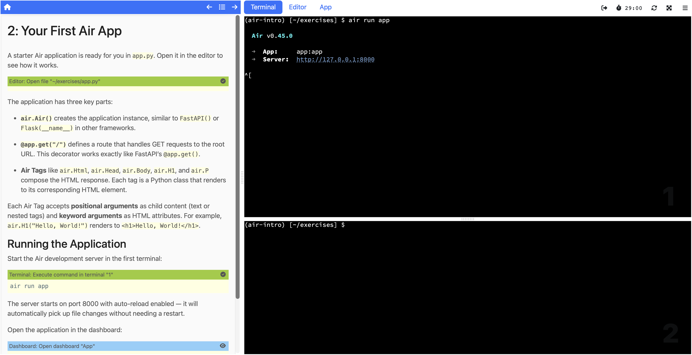

The way we direct AI coding agents has changed significantly over the past couple of years. Early on, the interaction was purely conversational. You'd open a chat, explain what you wanted, provide whatever context seemed relevant, and hope the model could work with it. If it got something wrong or went down the wrong path, you'd correct it and try again. It worked, but it was ad hoc. Every session started from scratch. Every conversation required re-establishing context.

What's happened since then is a steady progression toward giving agents more structured, persistent knowledge to work with. Each step in that progression has made agents meaningfully more capable, to the point where they can now handle tasks that would have been unrealistic even a year ago. I've been putting these capabilities to work on a specific challenge: getting an AI to author interactive workshops for the [Educates](https://github.com/educates/educates-training-platform/) training platform. In my [previous posts](/posts/2026/02/when-ai-content-isnt-slop/) I talked about why workshop content is actually a good fit for AI generation. Here I want to explain how I've been making that work in practice.

## How agent steering has evolved

The first real step beyond raw prompting was agent steering files. These are files you place in a project directory that give the agent standing instructions whenever it works in that context. Think of it as a persistent briefing document. You describe the project structure, the conventions to follow, the tools to use, and the agent picks that up automatically each time you interact with it. No need to re-explain the basics of your codebase every session. This was a genuine improvement, but the instructions are necessarily general-purpose. They tell the agent about the project, not about any particular domain of expertise.

The next step was giving agents access to external tools and data sources through protocols like the Model Context Protocol (MCP). Instead of the agent only being able to read and write files, it could now make API calls, query databases, fetch documentation, and interact with external services. The agent went from being a conversationalist that could edit code to something that could actually do things in the world. That opened up a lot of possibilities, but the agent still needed you to explain what to do and how to approach it.

Planning modes added another layer. Rather than the agent diving straight into implementation, it could first think through the approach, break a complex task into steps, and present a plan for review before acting. This was especially valuable for larger tasks where getting the overall approach right matters more than any individual step. The agent became more deliberate and less likely to charge off in the wrong direction.

Skills represent where things stand now, and they're the piece that ties the rest together. A skill is a self-contained package of domain knowledge, workflow guidance, and reference material that an agent can invoke when working on a specific type of task. Rather than the agent relying solely on what it learned during training, a skill gives it authoritative, up-to-date, structured knowledge about a particular domain. The agent knows when to use the skill, what workflow to follow, and which reference material to consult for specific questions.

With the advances in what LLMs are capable of combined with these structured ways of steering them, agents are genuinely reaching a point where their usefulness is growing in ways that matter for real work.

## Why model knowledge isn't enough

Large language models know something about most topics. If you ask an AI about Educates, it will probably have some general awareness of the project. But general awareness is not the same as the detailed, precise knowledge you need to produce correct output for a specialised platform.

Educates workshops have specific YAML structures for their configuration files. The interactive instructions use a system of clickable actions with particular syntax for each action type. There are conventions around how learners interact with terminals and editors, how dashboard tabs are managed, how Kubernetes resources are configured, and how data variables are used for parameterisation. Getting any of these wrong doesn't just produce suboptimal content, it produces content that simply won't work when someone tries to use it.

I covered the clickable actions system in detail in my [last post](/posts/2026/02/clickable-actions-in-workshops/). There are eight categories of actions covering terminal execution, file viewing and editing, YAML-aware modifications, validation, and more. Each has its own syntax and conventions. An AI that generates workshop content needs to use all of these correctly, not approximately, not most of the time, but reliably.

This is where skills make the difference. Rather than hoping the model has absorbed enough Educates documentation during its training to get these details right, you give it the specific knowledge it needs. The skill becomes the agent's reference manual for the domain, structured in a way that supports the workflow rather than dumping everything into context at once.

## The Educates workshop authoring skill

The obvious approach would be to take the full Educates documentation and load it into the agent's context. But AI agents work within a finite context window, and that window is shared between the knowledge you give the agent and the working space it needs for the actual task. Generating a workshop involves reasoning about structure, producing instruction pages, writing clickable action syntax, and keeping track of what's been created so far. If you consume most of the context with raw documentation, there's not enough room left for the agent to do its real work. You have to be strategic about what goes in.

The skill I built for Educates workshop authoring is a deliberate distillation. At its core is a main skill definition of around 25 kilobytes that captures the essential workflow an agent follows when creating a workshop. It covers gathering requirements from the user, creating the directory structure, generating the workshop configuration file, writing instruction pages with clickable actions, and running through verification checklists at the end. This isn't a copy of the documentation. It's the key knowledge extracted and organised to drive the workflow correctly.

Supporting that are 20+ reference files totalling around 300 kilobytes. These cover specific aspects of the platform in the detail needed to get things right: the complete clickable actions system across all eight action categories, Kubernetes access patterns and namespace isolation, data variables for parameterising workshop content, language-specific references for Python and Java workshops, dashboard configuration and tab management, workshop image selection, setup scripts, and more.

The skill is organised around the workflow rather than being a flat dump of information. The main definition tells the agent what to do at each step, and the reference files are there for it to consult when it needs detail on a particular topic. If it's generating a terminal action, it knows to check the terminal actions reference for the correct syntax. If it's setting up Kubernetes access, it consults the Kubernetes reference for namespace configuration patterns. The agent pulls in the knowledge it needs when it needs it, keeping the active context focused on the task at hand.

There's also a companion skill for course design that handles the higher-level task of planning multi-workshop courses, breaking topics into individual workshops, and creating detailed plans for each one. But the workshop authoring skill is where the actual content generation happens, and it's the one I want to demonstrate.

## Putting it to the test with Air

To show what the skill can do, I decided to use it to generate a workshop for the [Air web framework](https://airwebframework.org/). Air is a Python web framework written by friends in the Python community. It's built on FastAPI, Starlette, and HTMX, with a focus on simplicity and minimal JavaScript. What caught my attention about it as a test case is the claim on their website: "The first web framework designed for AI to write. Every framework claims AI compatibility. Air was architected for it." That's a bold statement, and using Air as the subject for this exercise is partly a way to see how that claim holds up in practice, not just for writing applications with the framework but for creating training material about it.

There's another reason Air makes for a good test. I haven't used the framework myself. I know the people behind it, but I haven't built anything with it. That means I can't fall back on my own knowledge to fill in gaps. The AI needs to research the framework and understand it well enough to teach it to someone, while the skill provides all the Educates platform knowledge needed to structure that understanding into a proper interactive workshop. It's a genuine test of both the skill and the model working together.

The process starts simply enough. You tell the agent what you want: create me a workshop for the Educates training platform introducing the Air web framework for Python developers. The phrasing matters here. The agent needs enough context in the request to recognise that a relevant skill exists and should be applied. Mentioning Educates in the prompt is what triggers the connection to the workshop authoring skill. Some agents also support invoking a skill directly through a slash command, which removes the ambiguity entirely. Either way, once the skill is activated, its workflow kicks in. It asks clarifying questions about the workshop requirements. Does it need an editor? (Yes, learners will be writing code.) Kubernetes access? (No, this is a web framework workshop, not a Kubernetes one.) What's the target difficulty and duration?

I'd recommend using the agent's planning mode for this initial step if it supports one. Rather than having the agent jump straight into generating files, planning mode lets it first describe what it intends to put in the workshop: the topics it will cover, the page structure, and the learning progression. You can review that plan and steer it before any files are created. It's a much better starting point than generating everything and then discovering the agent went in a direction you didn't want.

From those answers and the approved plan, it builds up the workshop configuration and starts generating content.

```
lab-python-air-intro/
├── CLAUDE.md
├── README.md
├── exercises/
│   ├── README.md
│   ├── pyproject.toml
│   └── app.py
├── resources/
│   └── workshop.yaml
└── workshop/
    ├── setup.d/
    │   └── 01-install-packages.sh
    ├── profile
    └── content/
        ├── 00-workshop-overview.md
        ├── 01-first-air-app.md
        ├── 02-air-tags.md
        ├── 03-adding-routes.md
        └── 99-workshop-summary.md
```

The generated workshop pages cover a natural learning progression:

1. Overview, introducing Air and its key features
2. Your First Air App, opening the starter `app.py`, running it, and viewing it in the dashboard
3. Building with Air Tags, replacing the simple page with styled headings, lists, and a horizontal rule to demonstrate tag nesting, attributes, and composition
4. Adding Routes, creating an about page with `@app.page`, a dynamic greeting page with path parameters, and navigation links between pages
5. Summary, recapping concepts and pointing to further learning

What the skill produced is a complete workshop with properly structured instruction pages that follow the guided experience philosophy. Learners progress through the material entirely through clickable actions. Terminal commands are executed by clicking. Files are opened, created, and modified through editor actions. The workshop configuration includes the correct YAML structure, the right session applications are enabled, and data variables are used where content needs to be parameterised for each learner's environment.



You can browse the generated files in the [sample repository on GitHub](https://github.com/GrahamDumpleton/lab-python-air-intro). If you check the commit history you'll see how little had to be changed from what was originally generated.

The generated content covers the progression you'd want in an introductory workshop, starting from the basics and building up to more complete applications. At each step, the explanations provide context for what the learner is about to do before the clickable actions guide them through doing it. That rhythm of explain, show, do, observe, the pattern I described in my earlier posts, is maintained consistently throughout.

Is the generated workshop perfect and ready to publish as-is? Realistically, no. Although the AI can generate some pretty amazing content, it doesn't always get things exactly right. In this case three changes were needed before the workshop would run correctly.

The first was removing some unnecessary configuration from the `pyproject.toml`. The generated file included settings that attempted to turn the application into an installable package, which wasn't needed for a simple workshop exercise. This isn't a surprise. AI agents often struggle to generate correct configuration for `uv` because the tooling has changed over time and there's plenty of outdated documentation out there that leads models astray.

The second was that the AI generated the sample application as `app.py` rather than `main.py`, which meant the `air run` command in the workshop instructions had to be updated to specify the application name explicitly. A small thing, but the kind of inconsistency that would trip up a learner following the steps.

The third was an unnecessary clickable action. The generated instructions included an action for the learner to click to open the editor on the `app.py` file, but the editor would already have been displayed by a previous action. This one turned out to be a gap in the skill itself. When using clickable actions to manipulate files in the editor, the editor tab is always brought to the foreground as a side effect. The skill didn't make that clear enough, so the AI added a redundant step to explicitly show the editor tab.

That last issue is a good example of why even small details matter when creating a skill, and also why skills have an advantage over relying purely on model training. Because the skill can be updated at any time, fixing that kind of gap is straightforward. You edit the reference material, and every future workshop generation benefits immediately. You aren't dependent on waiting for some future LLM model release that happens to have seen more up-to-date documentation.

Even with those fixes, the changes were minor. The overall structure was correct, the clickable actions worked, and the content provided a coherent learning path. What would have taken hours of manual authoring to produce (writing correct clickable action syntax, getting YAML configuration right, maintaining consistent pacing across instruction pages) the skill handles all of that. A domain expert would still want to review the content, verify the technical accuracy of the explanations, and adjust the pacing or emphasis based on what they think matters most for learners. But the job shifts from writing everything from scratch to reviewing and refining what was generated.

## What this means

Skills are a way of packaging expertise so that it can be reused. The knowledge I've accumulated about how to author effective Educates workshops over years of building the platform is now encoded in a form that an AI agent can apply. Someone who has never created an Educates workshop before could use this skill and produce content that follows the platform's conventions correctly. They bring the subject matter knowledge (or the AI researches it), and the skill provides the platform expertise.

That's what makes this different from just asking an AI to "write a workshop." The skill encodes not just facts about the platform but the workflow, the design principles, and the detailed reference material that turn general knowledge into correct, structured output. It's the difference between an AI that knows roughly what a workshop is and one that knows exactly how to build one for this specific platform.

Both the workshop authoring skill and the course design skill are available now, and I'm continuing to refine them as I use them. If the idea of guided, interactive workshops appeals to you, the [Educates documentation](https://docs.educates.dev) is the place to start. And if you're interested in exploring the use of AI to generate workshops for Educates, do reach out to me.
