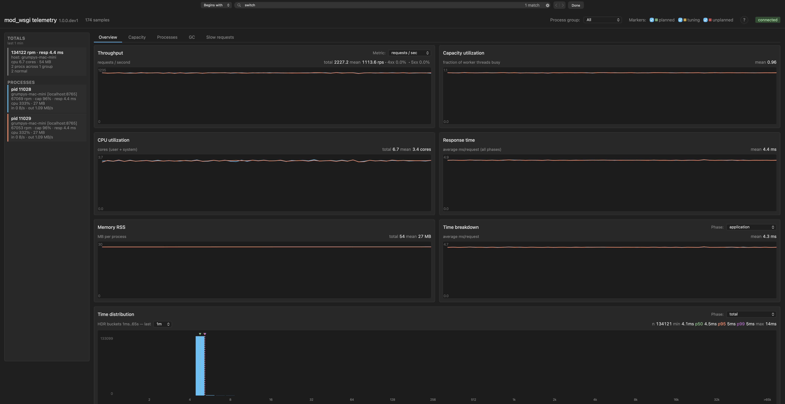
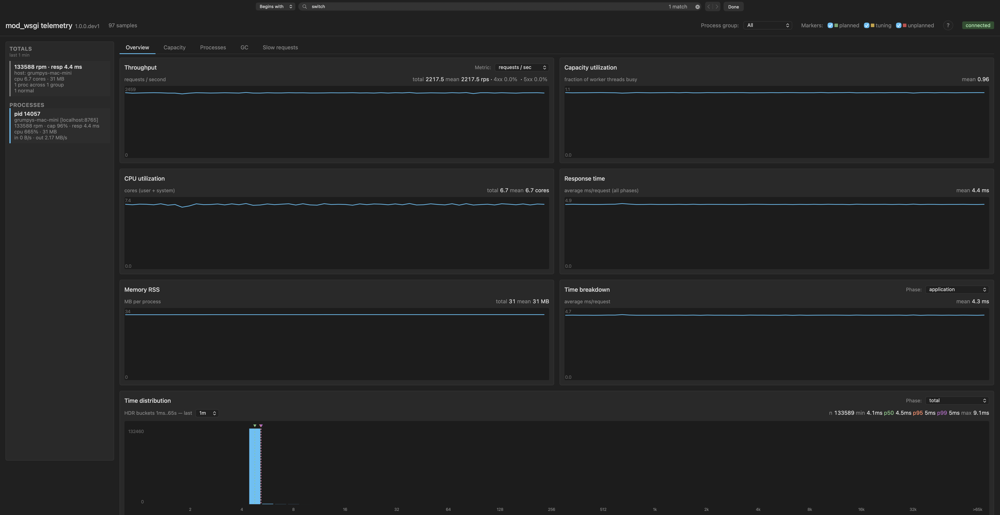

The [previous post](/posts/2026/05/wsgi-switch-interval-in-mod-wsgi-6-0-0/) in this series walked through tuning `WSGISwitchInterval` to claw back throughput on a multi-threaded mod_wsgi daemon group whose workload is CPU-bound Python. Tightening the switch interval recovered most of the throughput a two-process, five-thread shape had lost compared with the ten-process, one-thread baseline. What it did not change was per-process CPU usage. Each process stayed pinned at about one core regardless of how the switch interval was tuned, because that ceiling is the GIL itself.

This post is about what happens when that ceiling is removed. PEP 703 free-threading provides a CPython build with no GIL at all, and mod_wsgi 6.0.0 exposes the opt-in for it through [`WSGIFreeThreading`](/posts/2026/05/free-threading-in-mod-wsgi-6-0-0/), the second directive covered in this series. I have rerun the same benchmark workload on a free-threaded Python with that directive on. The interesting metric is now CPU usage per process.

## Why CPU usage is the new focus

Throughput and response time were the headline metrics for tracking the effect of switch interval changes. Both are still relevant here. But the comparison turns on something different now. With the GIL, threads in a process serialise on the lock, and the process consumes at most one core regardless of how many threads you give it. With free-threading there is no GIL, and the process can use as many cores as its threads can actually fill. If the workload is CPU-bound Python, CPU usage per process is what tells you whether the runtime is making real use of the hardware.

## What disappears from the toolkit

GIL wait time was the central diagnostic in the switch-interval post. Under free-threading there is no GIL, so there is no GIL wait to measure. The histogram that showed the convoy bumps at multiples of the switch interval in the previous post goes flat by definition. What replaces it as positive evidence that the workload is genuinely parallel is the CPU usage number itself. Multiple cores per process is the new signal.

## A reminder of what free-threading asks of you

The [free-threading post](/posts/2026/05/free-threading-in-mod-wsgi-6-0-0/) earlier in this series went into detail on what free-threading actually requires. Briefly: it is a separate CPython build (typically named `python3.14t` on systems that distribute it), C extensions must declare `Py_mod_gil = Py_MOD_GIL_NOT_USED` or the runtime quietly re-enables the GIL for the whole process, and application code must handle concurrent execution correctly rather than being incidentally safe under GIL atomicity. None of that has changed since I wrote that post. The metrics below assume those prerequisites are satisfied and show what the upside looks like when they are.

## The benchmark setup

The workload is the same as in the switch-interval post. Each request spends approximately 3 ms running Python code on the CPU, plus a 1 ms simulated wait, and returns a 1 KB response body. Concurrency 10, same host, same Apache, same WSGI handler. The only changes are that Python is the free-threaded build, mod_wsgi has `WSGIFreeThreading On` configured on the daemon group, and two configurations are exercised: two processes with five threads each (matching the comparison from the previous post), and one process with ten threads (a configuration that has no point under the GIL but lights up under free-threading).

## Comparison: two processes, five threads each

```
WSGIDaemonProcess my-app processes=2 threads=5
WSGIFreeThreading On
```

| Config | rpm | response | CPU/proc | CPU total | GIL p95 |
|---|---|---|---|---|---|
| 10 × 1 GIL (baseline) | 134k | 4 ms | 0.66 cores | 6.6 cores | none |
| 2 × 5 GIL, default 5 ms | 37k | 16 ms | 0.95 cores | 1.9 cores | 13 ms |
| 2 × 5 GIL, 0.1 ms tuned | 121k | 5 ms | 0.90 cores | 1.8 cores | 1 ms |
| 2 × 5 free-threading | 131k | 4 ms | 3.3 cores | 6.6 cores | n/a |



Throughput jumps to 131k rpm, almost matching the ten-process baseline of 134k, and well past what 0.1 ms switch interval tuning could achieve. Response time is back to 4 ms.

The row that has changed in character is CPU per process. Under the GIL each process was pinned at about one core no matter what we did with the switch interval. Free-threading lifts that ceiling, and each process is now consuming about 3.3 cores. Total CPU is 6.6 cores, the same as the ten-process baseline, but with one fifth the processes.

The GIL p95 column has no value to report any more. The histogram that showed contention bumps for missed switch-interval cycles is now flat. There is no GIL to schedule and no wait to measure.

## Comparison: one process, ten threads

```
WSGIDaemonProcess my-app processes=1 threads=10
WSGIFreeThreading On
```

Under the GIL this configuration would not really make sense. The threads would all queue for the one GIL, the process would cap at about one core, and throughput would likely be cut by half or more compared with the ten-process baseline. The exact figure depends on the workload and how the switch interval is set, but the shape is clear: one process with ten threads on a CPU-bound workload is not a configuration the GIL rewards.

Under free-threading the picture is dramatically different.

| Config | rpm | response | CPU/proc | CPU total | GIL p95 |
|---|---|---|---|---|---|
| 10 × 1 GIL (baseline) | 134k | 4 ms | 0.66 cores | 6.6 cores | none |
| 2 × 5 GIL, default 5 ms | 37k | 16 ms | 0.95 cores | 1.9 cores | 13 ms |
| 2 × 5 GIL, 0.1 ms tuned | 121k | 5 ms | 0.90 cores | 1.8 cores | 1 ms |
| 2 × 5 free-threading | 131k | 4 ms | 3.3 cores | 6.6 cores | n/a |
| 1 × 10 free-threading | 134k | 4 ms | 6.65 cores | 6.65 cores | n/a |



Throughput matches the ten-process baseline at 134k rpm. Response time is 4 ms. The single process is consuming about 6.65 cores. That is the headline finding of the comparison. The ten processes of the baseline have collapsed into one process that genuinely uses about 6.65 of the available cores.

## A note on the ceiling

Both the ten-process baseline and the one-process free-threading run land at the same total CPU usage of around 6.6 cores. That is not an artefact of the configurations meeting in the middle. It is the ceiling of the machine the tests are running on. The load generator is also running on the same host and is consuming some of the available CPU envelope itself. So the 134k rpm number is the ceiling of *this machine* under *this workload*, not a fundamental ceiling of either configuration. On a more capable host, or with the load generator run from a separate machine, both configurations could likely scale further. The point being made in the comparison is the *shape* of CPU usage across configurations, not the absolute throughput number.

## What this means in practice

Free-threading is another lever in the mod_wsgi concurrency toolkit. The free-threading post earlier in this series introduced it. This post shows what it does when applied to a workload that fits.

A few operational implications follow from the numbers above.

Memory. Fewer processes means less duplicated interpreter state, fewer copies of the application code in memory, fewer per-process caches. The ten-process baseline reported around 200 MB total RSS. The one-process free-threaded run reported around 31 MB. That is a real saving for memory-constrained deployments, and it is largely independent of whether the throughput is fully utilising the hardware.

Topology. One daemon group with a thread pool is simpler to operate than ten separate processes. Fewer file descriptors, fewer accept queues, one unit to restart and reload, easier capacity reasoning.

Trade-off. Process-level isolation is less granular. A crash in a thread on a single-process pool takes the whole pool with it, where on a multi-process pool it would only take one worker. For many workloads that is a fair trade, especially if the application itself does not crash frequently in production. For others, keeping at least a handful of processes around still makes sense. Free-threading composes happily with that, and the 2 × 5 configuration above is exactly that intermediate point.

## Caveats

The constraints from the [free-threading post](/posts/2026/05/free-threading-in-mod-wsgi-6-0-0/) all still apply. Free-threaded CPython is a separate build and not the one most distributions ship as default. C extensions need to declare free-threading support or the GIL silently comes back on for the whole process, undoing the benefit. Application code needs to be genuinely thread-safe rather than incidentally OK because the GIL was doing the work. The free-threaded build also carries a small single-threaded overhead.

The case for adopting free-threading still rests on those prerequisites being met for your specific application. The metrics here just show what the lever does when they are.

## What's next

If you run mod_wsgi and the case made above is interesting for your application, please install the 6.0.0 release candidate against a free-threaded Python build, try `WSGIFreeThreading` against your real workload, and file issues against [the GitHub project](https://github.com/GrahamDumpleton/mod_wsgi) for anything that does not behave as the documentation says it should.

This concludes the directive tour of the new concurrency-related additions in mod_wsgi 6.0.0. I will look more closely at mod_wsgi-telemetry itself, the tool that has been quietly doing the work in every screenshot and table in this series, in some future posts.

For reference:

- [mod_wsgi documentation](https://modwsgi.readthedocs.io/en/latest/)
- [mod_wsgi 6.0.0 release notes](https://modwsgi.readthedocs.io/en/latest/release-notes/version-6.0.0.html)
- [Per-interpreter GIL and free-threading user guide](https://modwsgi.readthedocs.io/en/latest/user-guides/gil-modes-and-free-threading.html)
- [`WSGIFreeThreading` directive documentation](https://modwsgi.readthedocs.io/en/latest/configuration-directives/WSGIFreeThreading.html)
- [Previous post: Free-threading in mod_wsgi 6.0.0](/posts/2026/05/free-threading-in-mod-wsgi-6-0-0/)
- [Previous post: WSGISwitchInterval in mod_wsgi 6.0.0](/posts/2026/05/wsgi-switch-interval-in-mod-wsgi-6-0-0/)
