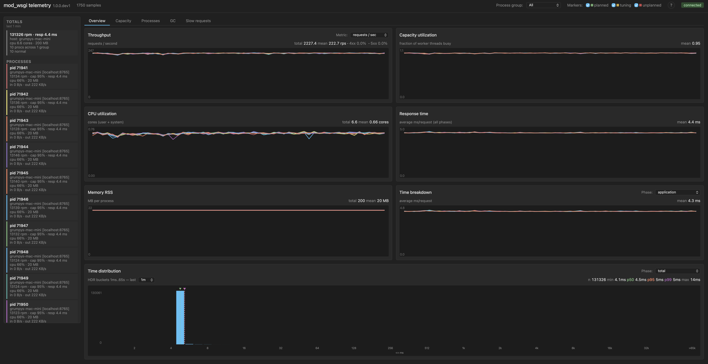
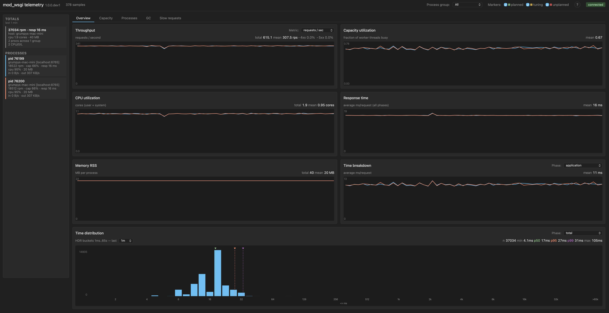
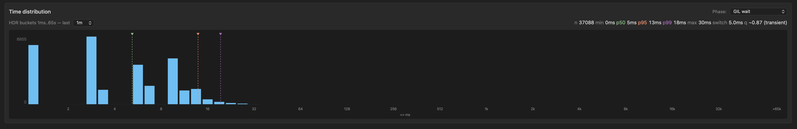
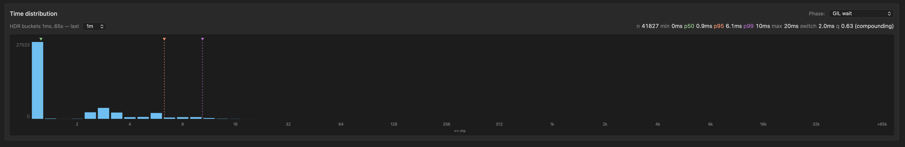
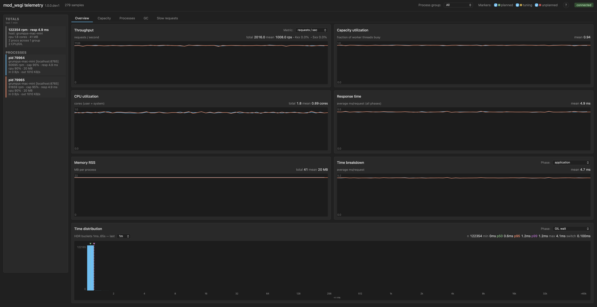
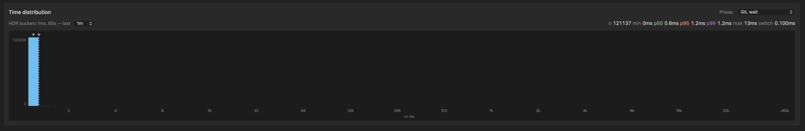

The first two posts in this series covered new directives in mod_wsgi 6.0.0 that change the concurrency model the interpreter runs under. [`WSGIPerInterpreterGIL`](/posts/2026/05/per-interpreter-gil-in-mod-wsgi-6-0-0/) opts a sub-interpreter into its own GIL. [`WSGIFreeThreading`](/posts/2026/05/free-threading-in-mod-wsgi-6-0-0/) opts a process into PEP 703 free-threaded mode. This third directive, `WSGISwitchInterval`, is a different sort of thing. It does not change the concurrency model. It exposes a Python tuning knob that has existed since Python 3.2 and that almost nobody touches, but that I have come to think is worth touching for a meaningful class of WSGI workloads.

The post is partly about what the directive does. Mostly though it is about a measurement story, and about why having telemetry to drive tuning decisions matters more than the directive itself.

## What the switch interval is

The Python GIL is the lock that serialises bytecode execution across threads in a CPython process. Only one thread at a time holds it. For other threads to make progress on Python code, the holder has to release the lock. Some releases are voluntary, for instance during I/O calls that drop the GIL while they wait. Voluntary releases are not enough on their own to schedule cleanly between several CPU-busy threads though, so the interpreter also has a scheduler that nudges the holder to give the lock up periodically. That scheduler is what the switch interval controls.

In CPython 2 the scheduler was bytecode-count based. After every N bytecodes the interpreter would check for pending signals, drop the lock, and reacquire it. The setting was `sys.setcheckinterval(N)`, default 100 ticks. The problem with bytecode counting was that bytecodes are not equal-cost. Some operations completed in a fraction of a microsecond. Others, like calling out into a slow built-in, took milliseconds. So the actual wall-clock interval between handoffs varied widely depending on what code was running.

Python 3.2 replaced this with a time-based scheduler. Antoine Pitrou's new GIL implementation moved the handoff trigger from "after N bytecodes" to "after T seconds since the last release", controlled by `sys.setswitchinterval()` with a default of 5 milliseconds. That default was a reasonable compromise on the hardware that existed in 2010. It has not changed since. Fifteen years on, on hardware that runs Python several times faster per cycle, the same 5 ms can be a much larger amount of Python work than it used to be. That is the rationale for considering whether the default is still the right value for your workload.

## What WSGISwitchInterval does

The directive calls `sys.setswitchinterval()` after interpreter initialisation, so the setting takes effect for the rest of that interpreter's life. The simplest form is at server scope.

```
WSGISwitchInterval 0.002
```

This applies to the embedded mode interpreter in Apache child processes. For daemon mode the equivalent is the `switch-interval=` option on `WSGIDaemonProcess`.

```
WSGIDaemonProcess my-app processes=2 threads=5 switch-interval=0.002
```

The directive can also appear inside the `<WSGIInterpreterOptions>` container introduced in the per-interpreter GIL post. If the matched sub-interpreter has its own GIL via `WSGIPerInterpreterGIL`, you can tune that one sub-interpreter's switch interval separately from the others in the same process.

```
<WSGIInterpreterOptions process-group="my-app" application-group="cpu-heavy">
    WSGIPerInterpreterGIL On
    WSGISwitchInterval 0.001
</WSGIInterpreterOptions>
```

Without an own-GIL on the matched sub-interpreter the directive cannot be made per-sub-interpreter, because the GIL is shared across the process and tuning it for one sub-interpreter would silently affect all of them. mod_wsgi rejects that configuration with a warning rather than silently scoping wider than the operator asked for.

Under free-threading the directive is a no-op. There is no GIL to schedule.

The default is to leave Python's own default alone. You opt in to tune.

## You cannot tune what you cannot measure

The case for adjusting the switch interval rests on being able to see what happens when you change it. Python itself does not expose any direct measure of GIL contention. There is no counter you can read to ask "how much time was spent waiting for the GIL". The interpreter knows in some sense, but it does not surface the information.

mod_wsgi exposes a partial measure, surfaced as `gil_wait_time`. It is the time the worker thread was held up acquiring the GIL at points where mod_wsgi is doing work on the application's behalf: request dispatch, request body reads, response writes, logging. It does not see contention while the application's own Python code is running, and it cannot see contention inside C extensions that release and reacquire the GIL on their own schedule. So the value is a lower bound, not an absolute measure of contention.

That is enough to drive tuning decisions, though. The metric moves directionally with actual contention. Combined with throughput and response time, three numbers from the same telemetry stream, it is enough to tell you whether a switch interval change helped or hurt.

The rest of the post is a worked example that uses exactly those three signals.

## A benchmark to make the case

The workload is a synthetic WSGI handler. Each request spends approximately 3 ms running Python code on the CPU, plus a 1 ms simulated wait standing in for a small bit of I/O, and returns a 1 KB response body. The load generator drives concurrency 10, more than enough to saturate the available workers in every configuration shown below. The workload is deliberately idealised, with no real I/O and no C extension calls, because the point is to surface the effect of GIL scheduling on pure-Python compute as clearly as possible.

All four configurations below run on the same host, same Apache, same Python, same WSGI handler. Only the process and thread counts and the switch interval change. Each step includes a small table of the key metrics so the numbers are legible even if the dashboard screenshots are too small to read, and the table grows as we go so each configuration can be compared with the ones before.

### Baseline: ten processes, one thread each

This is the no-contention reference point. Each daemon process has a single worker thread, so no two threads compete for the same GIL. Whatever GIL pressure shows up here is whatever overhead the lock adds on the dispatch and I/O paths in mod_wsgi itself, with no waiting.

```
WSGIDaemonProcess my-app processes=10 threads=1
```

The result is 134k requests per minute, 4 ms mean response time, `gil_wait_time` effectively zero. The GIL wait time distribution is a single bar in the head bucket, which is what no-contention looks like.

| Config | rpm | response | app | GIL p95 |
|---|---|---|---|---|
| 10 × 1, 5 ms (baseline) | 134k | 4 ms | 4 ms | none |



This is the upper bound for what the workload can do on the available cores when nothing contends with anything. Roughly 13.4k rpm per process.

### Add threads: GIL contention takes over

Keep the total worker pool roughly comparable, but reshape it: two processes with five threads each. Same default 5 ms switch interval.

```
WSGIDaemonProcess my-app processes=2 threads=5
```

Throughput collapses to 37k requests per minute, about 28% of the baseline. Mean response time goes from 4 ms to 16 ms. Application time mean is now 11 ms, up from 4 ms in the baseline. Each process is now CPU/GIL-bound: five threads competing for one GIL inside the process, with cores sitting underutilised because only one thread can run Python at a time.

| Config | rpm | response | app | GIL p95 |
|---|---|---|---|---|
| 10 × 1, 5 ms (baseline) | 134k | 4 ms | 4 ms | none |
| 2 × 5, 5 ms | 37k | 16 ms | 11 ms | 13 ms |



The shape of the contention is most visible in the GIL wait time distribution chart.



The chart tells a clear story. There is a head bucket holding the requests that got their handoff immediately, then a series of bumps further out at multiples of the 5 ms switch interval. Each bump corresponds to a request that had to wait one or more switch intervals to acquire the GIL: one missed cycle, two missed cycles, three missed cycles, and so on. The bumps shrink as you move right, which is the shape of a contention pattern where missed cycles do not pile up too heavily. But the tail is fat. The percentile numbers along the top of the chart confirm this: p95 is 13 ms and p99 is 18 ms, meaning a meaningful fraction of requests are waiting several full switch intervals to make progress on Python code.

This is the textbook case for the CPU/GIL-bound label. With five threads competing for one GIL on each process, the GIL is the wall. The standard remediation is to add processes. The point of this post is that there is a second lever, which is to make each handoff cheaper rather than less frequent.

### Tighten the switch interval to 2 ms

Same process and thread shape, but cut the switch interval from 5 ms to 2 ms.

```
WSGIDaemonProcess my-app processes=2 threads=5 switch-interval=0.002
```

Throughput moves from 37k to 42k requests per minute, about 13% better. Mean response time drops from 16 ms to 14 ms. The GIL wait time distribution chart is where the more interesting change shows up.

| Config | rpm | response | app | GIL p95 |
|---|---|---|---|---|
| 10 × 1, 5 ms (baseline) | 134k | 4 ms | 4 ms | none |
| 2 × 5, 5 ms | 37k | 16 ms | 11 ms | 13 ms |
| 2 × 5, 2 ms | 42k | 14 ms | 13 ms | 6 ms |



The chart is dramatically more head-heavy than at 5 ms. The head bucket now holds the bulk of the requests, where at 5 ms it was only about a fifth of them. Most requests are getting the GIL on their first try at the new interval. The smaller bumps further out are still there, but they sit closer to the head than their counterparts at 5 ms did, because each cycle is now 2 ms wide instead of 5 ms wide. The percentile numbers in the chart header confirm what the shape is showing: p50 has dropped from 5 ms to under 1 ms, p95 from 13 ms to 6 ms, p99 from 18 ms to 10 ms. Contention is both less frequent and cheaper when it does happen, and the throughput gain on the dashboard follows from that.

A reasonable stopping point for tuning the GIL switch interval on a mixed workload is around 2 ms. The reasoning is that more frequent GIL handoffs means more context switching, and at very short intervals that overhead can start to dominate. So if you do not have telemetry that lets you see the effect on your specific workload, 2 ms is a sensible place to stop. Going lower than that is something to do only when you can measure the result and confirm that the gain is real. The benchmark workload here is not a mixed workload, and the rest of this post is the measurement story that earns the right to go further.

### Tighten further to 0.1 ms

Same shape again, but switch interval down to 0.1 ms.

```
WSGIDaemonProcess my-app processes=2 threads=5 switch-interval=0.0001
```

Throughput jumps to 121k requests per minute. That is within roughly 10% of the no-contention baseline of 134k. Mean response time is back to 5 ms. Application time mean is back down to around 4.7 ms, close to its baseline value of 4.3 ms.

| Config | rpm | response | app | GIL p95 |
|---|---|---|---|---|
| 10 × 1, 5 ms (baseline) | 134k | 4 ms | 4 ms | none |
| 2 × 5, 5 ms | 37k | 16 ms | 11 ms | 13 ms |
| 2 × 5, 2 ms | 42k | 14 ms | 13 ms | 6 ms |
| 2 × 5, 0.1 ms | 121k | 5 ms | 5 ms | 1 ms |



The GIL wait time distribution collapses back to essentially the head bucket.



The bumps are gone. p95 is 1.2 ms and p99 is 1.2 ms, which is essentially "everything fits in the first bucket of the histogram". What is going on at this setting is that the switch interval is now much shorter than the per-request CPU cost. Each handoff happens many times during a single request's CPU work, so threads are interleaving at fine granularity rather than passing the GIL around in big chunks. There is no missed-cycle structure left for waiters to pile up on. Handoffs are continuous rather than periodic.

The workload is still CPU/GIL-bound in shape. Threads still spend most of their wall time holding a request without consuming CPU on it directly, because at any given instant only one thread per process can run Python. That structural fact has not changed. But the measured throughput cost of that shape has nearly vanished. The new switch interval has just made the cost of being that workload small enough not to hurt.

## What this means

The default 5 ms switch interval is conservative for a pure-Python CPU-bound workload. For workloads of that shape the knob is real, and the gain can be substantial. Three observations follow from that, all of them important.

Most WSGI applications do not look like this benchmark. The typical web request spends most of its time in I/O, in database calls, in C extensions like JSON parsers or template engines, in HTTP client libraries. All of those release the GIL during their slow phase. For those workloads the default is probably fine, and tuning the switch interval will not move much.

Stopping at around 2 ms is a sensible default for a mixed workload. It is not the answer for every workload, though. If you have endpoints that are heavy on Python compute, data processing endpoints, ML preprocessing, anything that does meaningful work in pure Python before returning, those endpoints may be in the same regime as this benchmark, and the same lever can apply. The further down you go past 2 ms the more important it is to have the telemetry that confirms you are actually winning rather than guessing.

The way you find out is by measuring. Throughput, response time, and `gil_wait_time` on the same telemetry stream, with the switch interval as the only variable, is enough to tell you whether tuning helps for your workload.

## Caveats

More frequent GIL handoffs mean more context switching. There is a cost to that, and at some interval that cost begins to dominate the gain. The benchmark workload here does not show that cost emerging at 0.1 ms, but that is partly because the workload is idealised. With real concurrency patterns and real I/O it would emerge sooner.

Tuning the switch interval down does not fix GIL contention inside C extensions that manage their own GIL acquire and release. If your contention lives inside NumPy or a database driver, this knob does not reach it.

The right framing is that this is a tuning lever for a specific class of workload, not a default to flip across the board. Use it where the measurements say it helps. Leave it alone where they say it does not.

## What's next

If you run mod_wsgi and the case above is interesting for your workload, please install the 6.0.0 release candidate, try `WSGISwitchInterval` against your real traffic, and file issues against [the GitHub project](https://github.com/GrahamDumpleton/mod_wsgi) for anything that does not behave the way the documentation suggests it should.

This post has leaned heavily on telemetry from mod_wsgi-telemetry, the companion tool that records and visualises the metrics shown in the screenshots above. That tool is going to be the subject of a follow-up series. Before we get to that though, the next post will revisit the free-threading configuration from earlier in this series and look at how performance under it manifests through the same request metrics used here. The argument for tuning at all rests on having that visibility, and the screenshots here are what the tool surfaces out of the box.

For reference:

- [mod_wsgi documentation](https://modwsgi.readthedocs.io/en/latest/)
- [mod_wsgi 6.0.0 release notes](https://modwsgi.readthedocs.io/en/latest/release-notes/version-6.0.0.html)
- [Per-interpreter GIL and free-threading user guide](https://modwsgi.readthedocs.io/en/latest/user-guides/gil-modes-and-free-threading.html)
- [`WSGISwitchInterval` directive documentation](https://modwsgi.readthedocs.io/en/latest/configuration-directives/WSGISwitchInterval.html)
- [Previous post: Per-interpreter GIL in mod_wsgi 6.0.0](/posts/2026/05/per-interpreter-gil-in-mod-wsgi-6-0-0/)
- [Previous post: Free-threading in mod_wsgi 6.0.0](/posts/2026/05/free-threading-in-mod-wsgi-6-0-0/)
