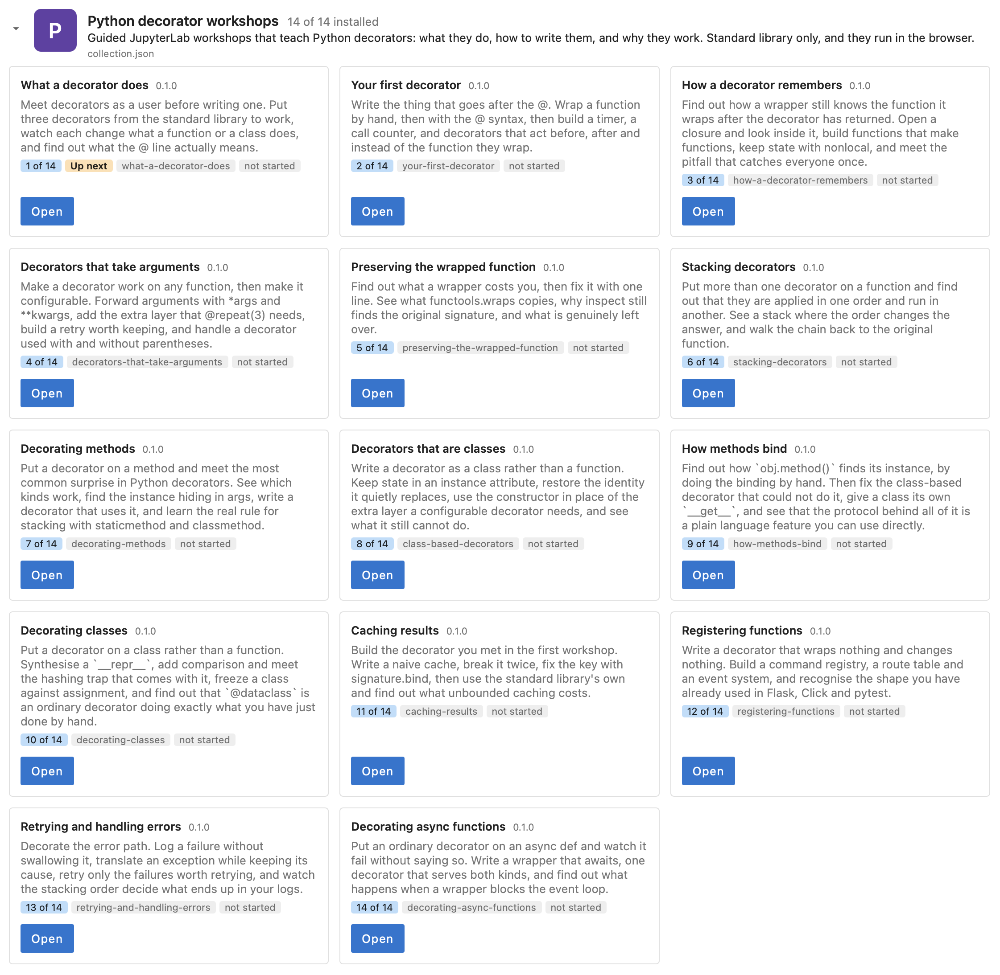
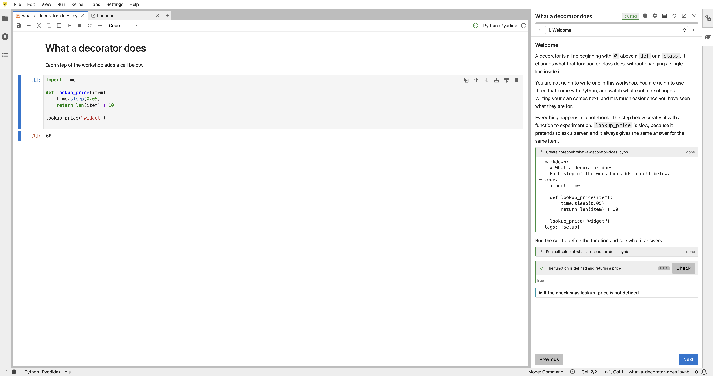

There is now a [Workshops](/workshops/) page on this site listing seventy free hands-on workshops, spread across five collections. They start with how decorators work in plain Python using nothing but the standard library, move on to what [wrapt](https://github.com/GrahamDumpleton/wrapt) adds for decorators, monkey patching and object proxies, and finish with patching, testing and tracing real code using [wrapture](https://github.com/GrahamDumpleton/wrapture). Taken in order they amount to a master class on the subject, and you don't need anything installed to work through them.

## Why I have been making these

My working life is in an odd place at the moment. I am on what has turned into an extended sabbatical, and I still haven't decided whether it ends with going back to a job or with retiring for good. The upside is that I have time to spare, and I have been putting it to use filling out the documentation and learning material for my open source projects, something that has always lagged well behind the code.

The other reason is that decorators, monkey patching and instrumentation are topics I have probably spent more time on than most people ever will. I have been maintaining wrapt for well over a decade, and it grew out of the monkey patching I wrote for the New Relic Python agent before that. A lot of what I learned along the way only exists in my head, or is scattered across old blog posts and issue discussions. Workshops are a way of getting that knowledge out in a form people can actually learn from, rather than it disappearing with me.

## Starting with the standard library

The first collection is 14 [Python decorator workshops](/workshops/python-decorators/). These replace the decorator workshops I [announced back in April](/posts/2026/04/free-python-decorator-workshops/), which were hosted on [Educates](https://educates.dev), with a rewritten and more focused set.

They use only the standard library. The first has you use decorators before writing one, putting a few from the standard library to work to find out what the `@` line actually means. From there you write your first decorator, find out how a wrapper remembers the function it wraps, give decorators arguments, and see what `functools.wraps` does and doesn't fix. The middle of the collection deals with stacking decorators and with methods, which is where most decorators people write start to go wrong. That includes working out how `obj.method()` finds its instance by doing the binding by hand, since that is what explains why a class based decorator can't be used on a method without extra work. The last few are practical: decorating classes, caching results, registering functions the way Flask, Click and pytest do, retrying and handling errors, and decorating async functions.

## Decorators, patching and proxies with wrapt

In the April post I said the natural follow on would be a course built around wrapt. That has now happened, as three collections in the [wrapt workshops](/workshops/wrapt/).

The first collection, of 12 workshops, covers writing decorators with wrapt. Each workshop puts the wrapt version beside the standard library version it replaces, so you can see what each one gives you. It starts with the wrapper function wrapt expects and what the `instance` argument tells you about whether you are decorating a function, an instance method, a class method, a static method or a class. Later workshops cover keeping state in a decorator, switching a decorator off, validating arguments, per instance caching of methods, synchronising calls across threads and in async code, and changing the signature a decorated function reports.

The second collection, of 10 workshops, is on monkey patching code you didn't write. It covers patching every kind of method, taking a patch out again, patches which only last for a block of code, why a patch applied correctly can still do nothing, applying a patch before the target module has even been imported, and patching instance attributes. It ends by putting all of that together into the shape every instrumentation agent ends up having.

The third collection, of 10 workshops, is on object proxies, where one object stands in for another. You start by writing a delegating class by hand and seeing what it gets wrong, then find out what a proxy passes through to the object it wraps and what it deliberately doesn't. From there it covers intercepting special methods, the function wrapper that sits under every wrapt decorator, lazy proxies used for deferring imports, holding a function weakly, and pickling and copying a proxy.

## Patching, testing and tracing with wrapture

The final collection is the 24 [wrapture workshops](/workshops/wrapture/), which I first mentioned when [wrapture reached its first beta](/posts/2026/09/trying-out-wrapture/). They build on everything before them and range quite widely.

For testing, they cover writing unit tests by wrapping the real code rather than replacing it, recording what the real code did and turning that into a test, behaviour that changes over time, async code and generators, using wrapture properly with pytest, and converting an existing test suite that uses `unittest.mock`. For tracing, they cover a program narrating its own calls, tracing a program without changing it, analysing a trace in a notebook, recording each request to a Flask application as a tree of calls, finding slow code, exporting to OpenTelemetry, and following one trace across two processes. They also return to monkey patching as a discipline, changing what a third party library does in a way you can reverse, and finish with writing an instrumentation package for a library nobody has covered yet.

## You don't need to do them all

Although the collections form a path from start to finish, nobody needs to work through all of them. If you are fairly new to Python, the decorator workshops, plus the first few of the wrapt decorator workshops, are probably all you will want. The later wrapt workshops, and much of wrapture, go into territory most Python developers never need to visit.

Equally, you can just pick out whatever looks interesting, or whatever covers a problem you have right now. If you already know decorators and need to patch a library you don't control, start with the wrapt monkey patching workshops. If you want better tests, or need to understand what a running application is actually doing, go straight to wrapture. Within a collection the workshops are ordered so each builds on the one before, but you can jump in anywhere.

## How the workshops are hosted

Each set of workshops lives in its own repository on GitHub. The workshops run in JupyterLab using [jupyterlab-workshop](https://github.com/GrahamDumpleton/jupyterlab-workshop), an extension I wrote which puts the workshop instructions in a side panel beside the notebooks, terminals and files you work with. I wrote about it in [Introducing jupyterlab-workshop](/posts/2026/09/introducing-jupyterlab-workshop/), and about how a workshop is put together in [Writing a workshop for JupyterLab](/posts/2026/09/writing-a-workshop-for-jupyterlab/).

When you open a collection, the extension shows its workshops in the order to take them, what each covers, and how far you have got with each.

Opening a workshop puts its instructions in the side panel. Actions in the instructions do things in the session for you, such as creating a notebook or running a cell, and checks confirm you have done a step before you move on.

There are a few ways to launch a collection, and the page for each collection on this site has buttons for them. The decorator workshops can run entirely inside your browser using [JupyterLite](https://jupyterlite.readthedocs.io), where Python itself runs in WebAssembly. Nothing runs on a server, and your work is kept in your browser's storage between visits. That is what the second screenshot above shows. For now only the decorator workshops run this way.

Every collection can also be launched on [mybinder.org](https://mybinder.org), a free public service which needs no account. It builds the repository into a temporary JupyterLab session, which can take a minute or two, and the session is discarded when you finish. Alternatively, [GitHub Codespaces](https://github.com/features/codespaces) runs the same setup under your own GitHub account, using your Codespaces allowance, and keeps the codespace around until you delete it. If you would rather use your own machine, the README in each repository explains how to run the workshops locally.

## What comes next

These collections will keep being refined, and I would like to hear about anything which is confusing or wrong. The GitHub repository for each collection is the place to raise an issue.

Beyond these, I plan to do workshops on WSGI and [mod_wsgi](https://github.com/GrahamDumpleton/mod_wsgi), which is the other area where I have years of accumulated knowledge that has never been written down properly. I also want to look at what workshops I could create for people newer to Python, alongside the more detailed ones I have been doing so far. If there is a topic you think is badly served by what is already out there, let me know.
