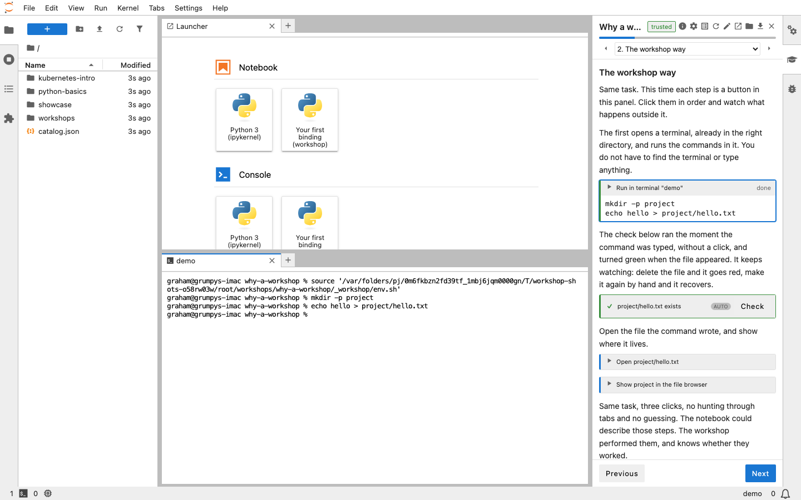

When I released the [24 wrapture workshops](/posts/2026/09/trying-out-wrapture/) last week, they ran in JupyterLab on mybinder with the instructions in a side panel, and I said at the end of that post that the panel deserved a post of its own. The panel is [jupyterlab-workshop](https://github.com/GrahamDumpleton/jupyterlab-workshop), a JupyterLab extension I wrote the week before. The workshops were the reason it exists, and the first thing built with it. If you know I have spent years working on [Educates](https://educates.dev) and are wondering why I did not simply use that, there is a reason, and I come to it near the end.

The extension has [documentation](https://jupyterlab-workshop.readthedocs.io/) on ReadTheDocs and is on [PyPI](https://pypi.org/project/jupyterlab-workshop/). The short description is that it separates the instructions for a workshop from the work. The instructions live in a sidebar panel, one page at a time. Each step on a page is a clickable action that does something real in the JupyterLab session beside it, whether that is running a command in a terminal, writing a file, creating a notebook and running its cells, executing code in a kernel, or arranging the window. The workshop can check what the learner has done, ask them questions, and hold a page until the checks pass. A workshop is a directory of Markdown files and a manifest, and it runs wherever JupyterLab runs.

## Why a notebook isn't a workshop

JupyterLab is already a natural place to teach, and the usual way to do it is a notebook. You write paragraphs of explanation with code cells between them and hand it to the learner to run. That works up to a point, and then it doesn't.

The first problem is that the learner reads down the page pressing Shift+Enter, or picks Run All, and finishes having done nothing. The notebook did the work and they watched. That is the passive walkthrough I argued in [Hands-on learning in the age of AI](/posts/2026/09/hands-on-learning-in-the-age-of-ai/) is exactly the kind of content that no longer needs a person to write it.

The second is that everything has to be a cell, in the notebook's one language. A lesson cannot ask for a shell command to be run, a file to be edited by hand, a second notebook to be created, or for anything JupyterLab itself does. If the thing being taught is git, or a command line tool, or a Python package that has to be installed into a virtual environment, or JupyterLab, a notebook can only describe it. It cannot be the place it happens.

The third is that the instructions and the work are the same document. What the learner ends up with is neither a clean set of notes nor a clean piece of work, and there is no way to tell, from either side, whether a step was done, done right, or skipped. A mistake early on that does not fail outright goes unnoticed until something much later fails for no obvious reason, and by then there is nothing pointing back to the cause.

## Instructions beside the work

The extension adds a Workshop panel as a sidebar tab. It shows one page of the workshop at a time, with Previous and Next buttons, a progress bar, and a drop-down for jumping between pages. The rest of the window is an ordinary JupyterLab session with terminals, the file browser, the editor, notebooks and kernels, all of which the learner would be using anyway.



The screenshot shows the kinds of things a page can do. The first action is a run in terminal block, marked done, with the two commands it ran. Clicking it opened the terminal in the main area, in the right directory, and typed the commands in, so the learner did not have to find the terminal or type anything. Below it is a check, which ran on its own the moment the terminal showed the command and turned green when the file appeared. This one is also on a timer, so it keeps watching. If the learner deletes the file it goes red, and if they make it again by hand it recovers. The two actions after that open the file the command wrote in the editor and reveal it in the file browser. The badge at the top of the panel shows the workshop was opened as trusted, which I come to below.

None of it is simulated. When a page says run this command, clicking the action runs it in a real terminal, and the learner can just as easily type it themselves, or type something else and see what happens. Actions cover the terminal, files and the editor, notebooks and kernels, the interface and layout, and guidance such as hints and guided tours of the interface. A page can also say how the window should be arranged when it opens, so a lesson can start with a README rendered above a terminal and nothing else in the way.

If you have used [Educates](https://educates.dev), the idea of [clickable actions](/posts/2026/02/clickable-actions-in-workshops/) driving a session will be familiar. That concept carried over. The implementation did not, since this is a JupyterLab extension written from scratch to work with what JupyterLab already provides.

## Checking the work

The part that makes it a workshop rather than a nicely formatted document is that a page can check what the learner has done. A `verify` block runs a check, which can be Python code run in a kernel of its own, separate from any the learner is using, a script run on the server, a shell command, or a list of predicates over files and the interface, such as a file existing, a file containing some text, a notebook cell having been executed, or a terminal being open. A `quiz` asks a question and a `form` collects values which can then flow into the commands and text on later pages.

A page can require some of those to have passed before the learner moves on, and the workshop manifest says whether that gating is advisory or enforced. Leaving a page with its requirements met marks it as completed, and the record of which pages have been completed is what the progress shown to the learner is based on. A `checkpoint` block snapshots the learner's files so a later page can put them back, which is how a workshop can have someone deliberately break something and then recover.

In the PyCon talk I said people quit at step eight because of a typo at step three, and that the fix is to have them verify their work after anything that can silently go wrong. Checks which run on their own the moment the terminal shows the expected output are that fix, built into the format rather than left to the author to remember.

Since a workshop can run commands on your machine, the learner is asked, before anything runs, how far to trust it. Every action type needs a capability, such as `terminal` or `write-files`, which the manifest has to declare, and an action whose capability is not declared never runs. When a workshop is opened the learner is told where it came from and what it wants permission to do, and chooses how much of that to allow. At the more cautious level, commands are typed into the terminal but not run until the learner presses Enter, and writing files or running code asks first. I will come back to that in a later post on deployment.

## What a workshop is made of

A workshop is a directory. There is a `workshop.yaml` manifest with the name, title, capabilities and the ordered list of pages, a `pages` directory with one Markdown file per page, and a `files` directory holding whatever ships to the learner, such as starter code or data. A `work` directory is generated when the workshop first opens, filled from `files`, and that is where the learner works. Restarting the workshop throws the contents away and fills it afresh, so a learner can always get back to a clean start. Everything is plain text, so a workshop lives happily in git.

A page is MyST Markdown, and the actions are fenced blocks with the action name in braces. This is a complete page, taken from the documentation:

````markdown
---
title: Your first commit
requires: [verify:first-commit]
---

Record the commit with a message describing the change.

```{execute}
git commit -m "Add README"
```

```{verify}
:id: first-commit
:label: You have made a commit
:trigger: terminal-output "Add README"
import subprocess
out = subprocess.run(["git", "log", "--oneline"], capture_output=True, text=True).stdout
assert out.strip(), "No commits yet: run git commit"
```
````

The `execute` block runs the command in a workshop terminal when clicked. The `verify` block runs its Python in the checking kernel, is triggered on its own when the terminal output contains the commit message, and the `requires` line in the front matter asks for it to pass before the learner can move on. That is about as much of the format as I want to show here. Writing a workshop from nothing is the subject of the next post.

## Where it runs

Anywhere JupyterLab runs, which is the point. On your own machine it installs into a virtual environment alongside JupyterLab with `uv add jupyterlab jupyterlab-workshop`, or the pip equivalent. If you only want to do workshops rather than write them, `uv tool install "jupyterlab-workshop[lab]"` gives you a `jupyter-workshop launch` command that starts JupyterLab with the extension and presents the workshops it found for the learner to choose from, with nothing else to set up.

Running on your own machine also opens up a use that is not teaching at all. A workshop makes a good setup wizard. For software with a fiddly install, a project could provide a workshop that walks through it with clickable actions instead of a page of instructions to copy from, checking after each step that it worked. Since a page can run a command in the background, capture its output into a variable, and show or hide what follows on that value, the instructions can adapt to the machine they are running on, finding out which shell, package manager or Python is present and showing only the steps that apply.

For workshops other people will do, the repository holding them can carry a Binder configuration, and [mybinder.org](https://mybinder.org) will build it into a temporary JupyterLab in the browser for anyone who clicks the link, with no account and no cost to anyone. That is how the wrapture workshops are hosted and I have no server, container image or cluster of my own behind them.

Since the wrapture posts went out, the same repositories have also gained a devcontainer, so they can be opened in [GitHub Codespaces](https://github.com/features/codespaces). That needs a GitHub account and uses the account's monthly Codespaces allowance, but where a Binder session is thrown away when it ends, a codespace is yours and persists, so a workshop can be finished across several sittings. Workshops can equally be shipped in a JupyterHub image, or built into a [JupyterLite](https://jupyterlite.readthedocs.io) site, which is JupyterLab compiled to run entirely in the browser with a Python kernel in WebAssembly, so a workshop becomes a set of static files on GitHub Pages with no server at all. The extension runs there unchanged, doing in the browser what its server side would otherwise do. Those options deserve a post of their own and will get one.

## Why not Educates

I have worked on Educates for years, and it remains the platform I would reach for when a workshop needs a Kubernetes cluster behind it, with several services, a database with data in it, or an environment already broken for the learner to diagnose. The wrapture workshops needed nothing like that. They needed a terminal, an editor and a Python virtual environment, and JupyterLab already provides all three.

The honest observation, which I will expand on in a later post about the challenges of getting Educates adopted, is that it requires Kubernetes and that has always limited who could pick it up. Large organisations either build their own platform or pay a vendor so there is someone to hold to a contract. Small teams and individuals are not going to take on running a cluster for the sake of delivering training. Turning Educates into a hosted service that people pay for would have meant starting a company, which is not something I wanted to do.

The idea of delivering the same guided experience as an extension to JupyterLab or VS Code is one I had many years ago and shelved. When I floated it with others it was generally dismissed, and getting the Jupyter community to engage on anything to do with training tooling has not been easy, so it stayed shelved. What AI has allowed me to do is finally loop back and build it, since bringing an idea like this to life is no longer the amount of effort it once was. That made it worth doing just to see whether it was possible, and if nobody else is interested, I have something I can use myself. Starting fresh also gave me the chance to explore new ideas in this space, which is not easy to do within the constraints of Educates as it stands.

The two are complementary rather than one replacing the other, and I suspect they appeal to different people. Educates suits an organisation with a training function and a cluster to run it on. A workshop that is a directory of text files, runs wherever JupyterLab runs, and can be hosted for free on mybinder or in the learner's own codespace, is something the maintainer of an open source project could provide for their own project without ever thinking about hosting. The same maintainer could use it for the guided install described above. The wrapture workshops are the worked example. One person, one library, 24 workshops, no infrastructure.

## Try it

The quickest way to see it is the [showcase collection](https://github.com/GrahamDumpleton/jupyterlab-workshop-showcase), three short workshops which show what the extension does and why, in a full JupyterLab with a real terminal. Launch it on [Binder](https://mybinder.org/v2/gh/GrahamDumpleton/jupyterlab-workshop-showcase/main?urlpath=lab) or in [Codespaces](https://codespaces.new/GrahamDumpleton/jupyterlab-workshop-showcase?quickstart=1). The showcase repository is also the pattern to copy for publishing a collection of your own. If you would rather not wait for a build, there is a [JupyterLite demo](https://grahamdumpleton.github.io/jupyterlab-workshop/demo/lab/index.html?reset&workshop=hello-jupyterlab&restart=force) of one workshop running entirely in the browser, started afresh on every visit.

For something more substantial, the [wrapture workshops](https://github.com/GrahamDumpleton/wrapture-workshops) are on [Binder](https://mybinder.org/v2/gh/GrahamDumpleton/wrapture-workshops/main?urlpath=lab) and [Codespaces](https://codespaces.new/GrahamDumpleton/wrapture-workshops?quickstart=1) as well. The [getting started](https://jupyterlab-workshop.readthedocs.io/en/latest/getting-started.html) page covers a local install and scaffolds a workshop of your own, and the [tutorial](https://jupyterlab-workshop.readthedocs.io/en/latest/tutorial.html) writes a small one from nothing and publishes it.

As with wrapture, the extension was developed with the help of AI coding assistants, working to my design and direction, with me reviewing what they produced. The wrapture workshops themselves were largely written by an AI agent using the extension's own authoring tooling, which is a story for a later post too. If you would rather not use software produced that way, that is understood.

## What's next

There are a few posts to follow. One on writing a workshop from scratch, one on the ways of getting workshops in front of people without running a server, one on writing them with an AI agent, and one on the challenges I ran into trying to get Educates adopted over the years and what I took from them, which were in part the catalyst for this extension existing at all. The problem of getting anyone to do a workshop once it exists is one I wrote about after PyCon and have no new answer to. If anything it may be getting harder, since I now lean on AI both to build the software and to write the workshops, and for many people that alone is reason enough to stay away. What I can do is make it as easy as possible to try, and that part is done. If you do try it, the [issue tracker](https://github.com/GrahamDumpleton/jupyterlab-workshop/issues) is where I would like to hear what worked and what didn't.
