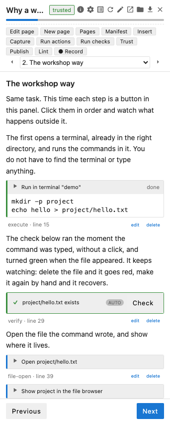

Yesterday's post [introduced jupyterlab-workshop](/posts/2026/09/introducing-jupyterlab-workshop/) and showed one page of a workshop. This one writes a whole workshop from an empty directory. It is small enough to fit in a post, but it has everything a real one has: a manifest, four pages, actions that drive the JupyterLab session, checks that run by themselves, a quiz, and the tooling that proves the workshop works before a learner ever sees it.

The subject is pytest. The workshop teaches the loop pytest is built around, which is write a test, watch one fail, fix the code, and it does that in four pages. Because pytest has to be installed, it is a chance to show how a workshop gets a Python environment of its own. It also lets me put the three content lessons from [my PyCon talk](/posts/2026/09/hands-on-learning-in-the-age-of-ai/) to work, since a workshop format is only useful if it makes it easier to do those things well.

## Plan the steps first

Before writing anything, decide the steps, and for each one decide what proves it was done. That second part is what distinguishes a workshop from a tutorial, and it also happens to be the constraint that keeps the steps small, because a step that ends in something checkable is rarely a big one.

For this workshop there are four. Set things up, which is done when pytest can be run. Write a first test, done when it passes. Add a second test that exposes a bug, done when the learner has predicted what pytest will say and then seen one test fail. Fix the bug, done when both tests pass. The prediction in the third step is the "change one thing and say what you think will happen" pattern from the talk, and the check on every page is the "verify after anything that can silently go wrong" one.

## Scaffolding

The `jupyter workshop` command that comes with the package scaffolds a workshop directory:

```
jupyter workshop init pytest-first-steps --title "Testing with pytest"
```

That writes a manifest, two example pages to replace, a README, a `.gitignore` and an empty `files/` directory. I threw the example pages away and made the manifest read:

```yaml
apiVersion: jupyterlab-workshop/v1alpha1
name: pytest-first-steps
title: Testing with pytest
version: 0.1.0
description: Write a first test with pytest, watch a second one fail, and fix the code it caught.
tags: [python, pytest, testing]
duration: 20m
platforms: [linux, macos]
capabilities:
  - terminal
  - write-files
  - kernel-exec
  - install-packages
environment:
  requirements: requirements.txt
env:
  PYTHONDONTWRITEBYTECODE: "1"
layout: default
gating: soft
pages:
  - pages/01-set-up.md
  - pages/02-first-test.md
  - pages/03-a-failing-test.md
  - pages/04-fix-the-bug.md
```

The `capabilities` list is what the learner will be asked to trust when the workshop opens. This one runs commands in a terminal, writes files in the learner's workspace, runs code in a kernel, which the checks need, and installs packages. An action whose capability is not declared never runs, and the linter checks the list against what the pages actually use, in both directions.

The `environment` field is how the workshop gets pytest. The `requirements.txt` beside the manifest has one line in it, `pytest`, and the first page has an action that creates a virtual environment from it. The environment lives inside the workshop directory, so nothing else on the learner's machine changes, and once it exists it is first on the path in the workshop's terminals and in the checks, with no activation step anywhere on a page. A kernel is registered for it too, which a notebook workshop would use. That is far better than walking the learner through `python -m venv` and `pip install`, since the workshop is there to teach pytest, not how to create virtual environments.

The `env` entry guards against a problem that can arise when a file changes in quick succession, which in a workshop happens whenever a learner clicks rapidly through the steps. Python reuses cached bytecode whenever a source file's size and its modification time in whole seconds are unchanged, so an edit that swaps text for text of the same length, made within a second of the previous run, runs the old code. The self-test, which runs actions back to back, hits it even more readily. Turning bytecode caching off makes it go away. The other fields are less interesting. `layout: default` opens a terminal beneath the main area, and `gating: soft` means a learner can move past a page whose check has not passed, but is told so, and the page is not marked as done.

The one file the workshop ships to the learner is `files/orders.py`. Anything in `files/` is copied into a `work/` directory when the workshop first opens, and that is where the learner works, where the terminals start, and what restarting the workshop empties and refills. The function has a bug in it, on purpose:

```python
"""Order totals for a small shop."""


def total(prices, discount=0):
    """Add up the prices and take off a percentage discount."""

    subtotal = sum(prices)

    return subtotal - discount
```

## Page one: set up

A page is a Markdown file with YAML front matter, and the actions are fenced blocks with the action name in braces. Options are `:name: value` lines at the top of the block and the rest is the body.

````markdown
---
title: Set up
requires: [verify:pytest-available]
---

# Set up

pytest is the test runner most Python projects use. In this workshop
you write a test for a small function, add a second test and watch it
fail, then fix the code the test caught.

The function is in `orders.py`, which is already in your workspace.
Open it and read it before going on.

```{file-open}
:path: orders.py
```

pytest is not part of Python, so the workshop needs an environment
with it installed. This creates one inside the workshop directory, so
nothing else on your machine changes.

```{environment-create}
:title: Create the workshop environment
```

Once it exists the workshop terminal picks it up. Confirm pytest is
there.

```{execute}
:id: pytest-version
:wait: prompt
python -m pytest --version
```

```{verify}
:id: pytest-available
:label: pytest is installed
:substrate: shell
:trigger: after:pytest-version
python -m pytest --version
```
````

The `requires` line in the front matter says the page is not done until the `pytest-available` check has passed. The `file-open` action opens the shipped file in the editor beside the panel, so the learner has read the function before being asked to test it. The `environment-create` action creates the virtual environment from the requirements file, with the text before it saying why that is needed. The check at the end of the page then confirms that pytest was installed into it, so progress past the page is gated on the environment actually working.

The `execute` action runs its body in the workshop terminal, and `:wait: prompt` makes it wait until the shell is back at its prompt before reporting that it is done, rather than the moment the command has been typed. The `verify` after it is triggered by that completion, so the check runs by itself once the learner has taken the step. The check runs its own command rather than relying on what the terminal did, so here it would pass at any point after the environment exists, but tying it to the step keeps it from running before the learner has got there. The check uses the `shell` substrate, meaning its body is run as a shell command and exit code zero passes. Its output becomes the message the learner sees with the check, which here is the pytest version.

## Page two: the first test

````markdown
---
title: The first test
requires: [verify:first-test-passes]
---

# The first test

pytest finds tests on its own: any file named `test_*.py`, and in it
any function named `test_*`. A test is a plain function that calls
the code and uses `assert` to say what it expects. This writes one for
`total()` and opens it in the editor.

```{file-write}
:id: write-test
:path: test_orders.py
:open: true
from orders import total


def test_total_adds_the_prices():
    assert total([10, 20]) == 30
```

Run it. The `-q` keeps the output to one character per test and a
summary line.

```{execute}
:id: run-first-test
:wait: prompt
python -m pytest -q
```

A dot is a pass. The check below runs the tests itself, so it passes
whether you clicked the command or typed it.

```{verify}
:id: first-test-passes
:label: The first test passes
:substrate: shell
:trigger: after:run-first-test
out=$(python -m pytest -q --color=no test_orders.py 2>&1) && { printf '%s\n' "$out" | tail -n 1; exit 0; }; printf '%s\n' "$out"; exit 1
```
````

`file-write` writes its body to a file in the workspace, and with `:open: true` shows it in the editor, so the learner sees the test appear rather than being asked to type it. Typing it yourself is more work, and work is where learning happens, but a typo in a file you were told to copy teaches nothing except frustration. Writing the file and opening it in front of them, then having them type the command that runs it, is a reasonable compromise if you want the learner doing some things by hand rather than clicking an action for everything.

The check is worth a closer look, because it is a pattern that repeats through the workshop. A shell check's whole output is its message, so the command shapes it. On success it prints only the last line of pytest's output, the `1 passed in 0.00s` summary, and exits zero. On failure it prints everything pytest said and exits one, so the learner sees the failing assertion in the panel. The `--color=no` is there because escape codes in a check message are not helpful. And the check runs pytest itself rather than looking at what the terminal printed, which is the rule I would give anyone writing checks: check the outcome, not the keystrokes. It means the check passes whether the learner clicked the action, typed the command, or ran it some third way.

## Page three: a failing test

````markdown
---
title: A failing test
requires: [quiz:predict, verify:one-fails]
---

# A failing test

`total()` takes a `discount`, which its docstring says is a
percentage. Add a test that holds it to that: ten percent off thirty
should be twenty-seven.

```{editor-insert}
:id: add-discount-test
:path: test_orders.py


def test_discount_is_a_percentage():
    assert total([10, 20], discount=10) == 27
```

Before running it, say what you think pytest will report.

```{quiz}
:id: predict
:title: Predict the result
question: What happens when you run pytest now?
options:
  - { text: One test passes and one fails, correct: true }
  - text: Both tests fail, because orders.py is wrong
    explanation: The first test never uses the discount, so the bug never reaches it. A test only checks what it asks about.
  - text: pytest stops at the first failure
    explanation: pytest runs every test it finds and reports them all, unless you ask it to stop with -x.
explanation: Each test runs on its own and is reported on its own, so the bug shows up in exactly the test that exercises it.
```

Now run it.

```{execute}
:id: run-second-test
:wait: prompt
python -m pytest -q
```

Read the failure from the bottom up. The last line counts what passed
and what failed, and above it pytest shows the assert that failed with
the value on each side, so you can see the function returned 20 where
27 was expected.

```{verify}
:id: one-fails
:label: One test fails and one passes
:substrate: shell
:trigger: after:run-second-test
out=$(python -m pytest -q --color=no test_orders.py 2>&1); case "$out" in *"1 failed, 1 passed"*) echo "One failed, one passed, as expected"; exit 0;; esac; printf '%s\n' "$out"; exit 1
```
````

`editor-insert` adds its body to the end of the file that is already open in the editor, and the learner watches it appear.

The quiz is the point of the page. It comes before the command, and the page is gated on it, so the learner has to commit to an answer before they can find out. The wrong options are not filler either. Each one has an explanation that teaches something a learner who picked it did not know, which is the only reason to have a wrong option at all. That question is the whole trick I described in the talk. If they are wrong they find out in about two seconds, and now they understand that pytest runs each test on its own.

The check then confirms the learner is in the state the next page assumes, one test failing and one passing, and it does that by looking for pytest's summary line. The `execute` action before it reports a pass even though the command exits with status one, since the action's job was to type the command, and it is the check's job to say what the result should have been.

## Page four: fix the bug

````markdown
---
title: Fix the bug
requires: [verify:all-pass]
---

# Fix the bug

The function subtracts the discount as an amount. The docstring, and
now the test, say it is a percentage. Change the last line so the
discount comes off as a fraction of the subtotal.

```{editor-replace}
:id: fix-discount
:path: orders.py
:match: return subtotal - discount
return subtotal * (100 - discount) / 100
```

Run the tests again.

```{execute}
:id: run-again
:wait: prompt
python -m pytest -q
```

Two dots. The test that caught the bug now guards against it coming
back, which is what a test is for.

```{verify}
:id: all-pass
:label: Both tests pass
:substrate: shell
:trigger: after:run-again
out=$(python -m pytest -q --color=no test_orders.py 2>&1) && { printf '%s\n' "$out" | tail -n 1; exit 0; }; printf '%s\n' "$out"; exit 1
```

That is the loop pytest is built around: write a test that says what
the code should do, watch it fail, make it pass. From here, the
[pytest documentation](https://docs.pytest.org/en/stable/getting-started.html)
covers fixtures and parametrised tests, which are the next two things
worth knowing.
````

`editor-replace` finds the text named by `:match:` in the file and swaps it for the body, leaving the new text selected in the editor so the learner can see exactly what changed. For a one line fix that is a much better experience than telling someone to edit line nine, and it also means the check can be certain about what the file now contains. The page ends by saying what was learned and where to go next, which is where every last page should end.

## Lint

With the four pages written, the linter reads the manifest and every page and reports what is wrong:

```
jupyter workshop lint pytest-first-steps
```

For the workshop above it prints `0 error(s), 0 warning(s)`, which is not much of a demonstration, so I broke a copy of it. I removed `kernel-exec` from the manifest, which the shell checks need, misspelt the `:session:` option on one of the commands, and made a typo in the action id that the last page's check is triggered by:

```
pages/02-first-test.md:27: warning: Option "sesion" is not used by the execute directive
workshop.yaml: error: Pages use the "kernel-exec" capability (4 actions) but the manifest does not declare it
pages/04-fix-the-bug.md:30: error: "all-pass" is triggered by unknown action "run-agian"
2 error(s), 1 warning(s)
```

The last of those is the one I would least like to ship. A check whose trigger names an action that does not exist still works when the learner runs it by hand, so nothing looks broken, it just never runs by itself the way the page says it will. That is exactly the kind of silent mistake a linter is for. The linter is about the mechanics: capabilities, options, checks that are malformed, ids that name nothing, variables used before the form that sets them, a few danger heuristics such as piping a download into a shell. It cannot tell though whether the workshop makes sense, and it cannot tell whether the commands work.

## Self-test

That second thing is what the self-test is for:

```
jupyter workshop test pytest-first-steps
```

It copies the workshop to a temporary directory, starts a JupyterLab of its own on a free port, opens the workshop in a headless browser with trust settled, and then does what a learner would do, page by page. It runs every action in order, waits for each terminal command to finish, answers the quiz correctly, and runs every check. The output for this workshop is one line per action:

```
PASS 01-set-up/01-set-up-1 (file-open, 0.1s)
PASS 01-set-up/01-set-up-2 (environment-create, 14.9s)  Environment ready with kernel "workshop-pytest-first-steps-fb5f5348"
PASS 01-set-up/pytest-version (execute, 0.2s)
PASS 01-set-up/pytest-available (verify, 1.5s)  pytest 9.1.1
PASS 02-first-test/write-test (file-write, 0.1s)
PASS 02-first-test/run-first-test (execute, 0.3s)
PASS 02-first-test/first-test-passes (verify, 0.3s)  1 passed in 0.00s
PASS 03-a-failing-test/add-discount-test (editor-insert, 0.0s)
PASS 03-a-failing-test/predict (quiz, 0.0s)  Each test runs on its own and is reported on its own, so the bug shows up in exactly the test that exercises it.
PASS 03-a-failing-test/run-second-test (execute, 0.4s)  The command exited with status 1
PASS 03-a-failing-test/one-fails (verify, 0.3s)  One failed, one passed, as expected
PASS 04-fix-the-bug/fix-discount (editor-replace, 0.0s)
PASS 04-fix-the-bug/run-again (execute, 0.3s)
PASS 04-fix-the-bug/all-pass (verify, 0.3s)  2 passed in 0.01s

14 passed, 0 failed, 0 skipped
```

The fifteen seconds on the second line is pip installing pytest into the new environment. Everything else is near enough instant. What the self-test gives you is that a workshop which drifts, because a tool changed its output or a package changed its behaviour, is caught before a learner finds it, and `jupyter workshop init --ci` writes a GitHub Actions workflow that runs the same thing on every push.

One warning that the documentation makes at some length and I will repeat. The temporary copy protects the workshop's own files and nothing else. Every command runs as you, on your machine, with your home directory and your environment. This workshop stays inside its own directory, so running it locally is fine. A workshop that changes global git configuration or installs things into your project's environment is better tested in CI, where every run gets a fresh machine.

## Author mode in JupyterLab

Everything above was done with a text editor and a terminal, which is how I prefer to work and how an AI agent works too. The pages can equally be written from inside JupyterLab, with the workshop open in the panel. Author mode is turned on from the panel header, the pencil icon in the screenshot below, and adds a toolbar and marks the workshop as your own, so saving a page never asks again how far the workshop is to be trusted.



Edit page opens the page source beside the panel and saving re-renders it. Insert is a form for an action: pick the type, fill in its options, write the body, and the block lands at the cursor. Capture turns what you just did in the session, the last terminal commands, the files you saved and the cells you ran, into actions on the page, which is a much better starting point than an empty file. Run actions and Run checks do for the current page what the self-test does for the whole workshop, in the session in front of you. Lint lists the findings for the workshop and can apply the fix for the mechanical ones itself, such as declaring a capability that is missing. Record goes further than Capture and records a whole session into draft pages, one action per step with a placeholder paragraph to fill in.

Files remain the source of truth throughout. Author mode reads and writes the same `workshop.yaml` and `pages/*.md` that the command line does, so you can move between the panel, an external editor and git without anything getting out of step. The same tools are also available to an AI agent over MCP, and the wrapture workshops were written that way, but that is a post of its own.

## Publishing

Once the self-test is green, `jupyter workshop publish` builds an archive:

```
jupyter workshop publish pytest-first-steps
```

```
wrote dist/pytest-first-steps-0.1.0.tar.gz
sha256 c7fa2db6c260130926478a779eabb4efb94149f7f2178f03a57983b694ddf745
wrote dist/pytest-first-steps-0.1.0.collection.json
```

The archive holds the manifest, the pages, the shipped files and the requirements, and leaves out the workspace and the workshop's runtime state. It is built with fixed ownership and timestamps, so the hash is the same on every machine and can be checked by whoever installs it. The collection entry is a JSON snippet describing the workshop for a collection index, which is the list of workshops a learner is offered to choose from. Where the archive and the index go, and the alternative of pointing an index straight at a git repository so there are no archives at all, is the subject of the next post.

## What's to be learned

The workshop is seven text files. A manifest, four pages and a function to test, plus a requirements file with one line in it. The tooling checks the mechanics, that the capabilities match, that the options are spelt right, that every command runs and every check passes, and it does that in about a minute without a person involved.

What the tooling does not do is decide that the workshop should have four pages rather than two, that the quiz should come before the command rather than after it, or that each page should end with a check that runs by itself. Those are the three content lessons from the talk, and they still fall to whoever writes the workshop. What the format does is make them cheap. A check is a few lines under the command it confirms. A quiz is a few lines of YAML. A page is a file, so splitting a step in two is a matter of where you put the front matter. When the right thing is that easy to do, it is more likely to get done, and that is about all a tool can offer.
